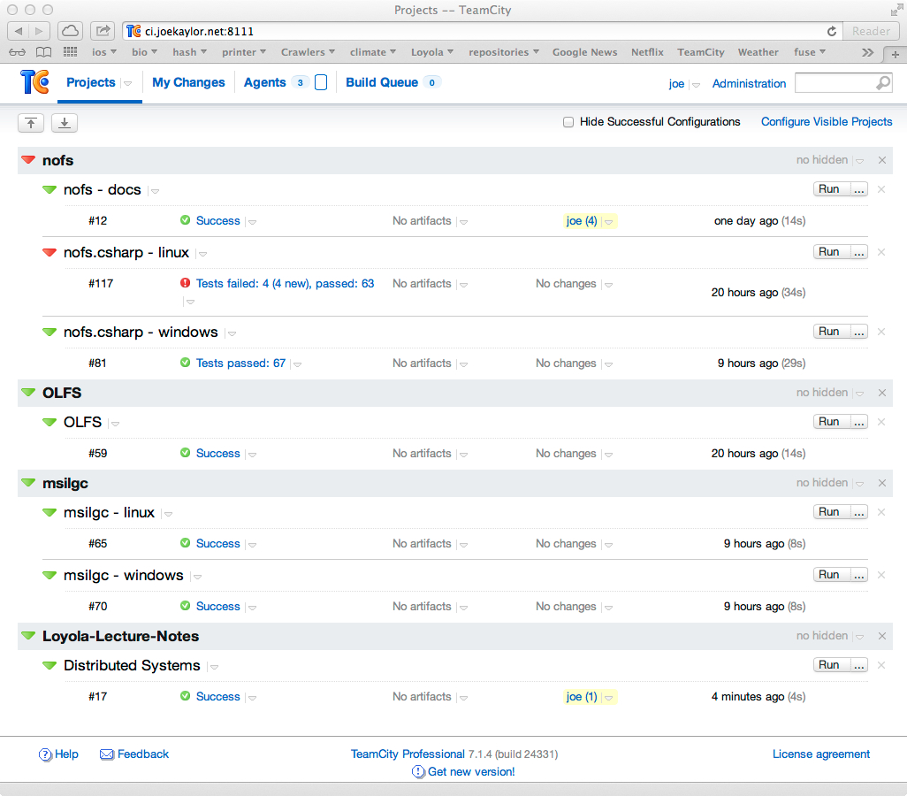
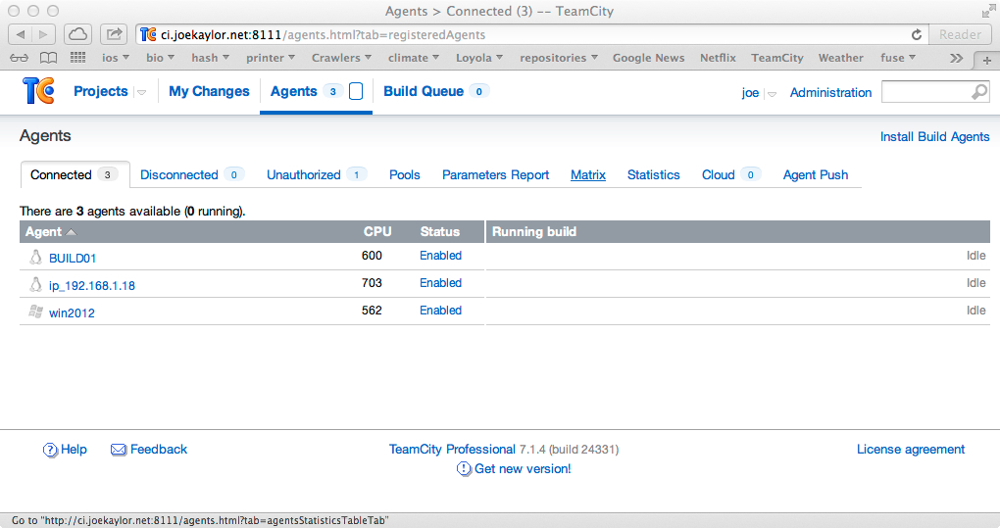

Continuous Integration
======================

What Does Continuous Integration Do?
------------------------------------

- To support incremental, agile development for one or more developers
- Provides notification of success or failure of forward integration as rapidly as possible. This is especially important on larger teams.
- Performs validation of the product by running unit tests, and automated user interface tests
- Can perform scheduled test or production environment deployments.

How Often is Continuous Integration Run?
----------------------------------------

- Continuous Integration can be run as:
	- Batches - once one build and verification is complete, another immediately starts (grouping more than once change, potentially)
	- Upon changes - build and validate the product at every change
	- Iteration builds - every day, every week, or some other short period, a distributable product with an installer or package is created. This can be used for manual testing by a test team or by customers.

What are the Bits and Pieces of Continuous Integration?
-------------------------------------------------------

- Build Controllers:
	- A service that coordinates build requests and build operations
	- Manages resources such as artifact repositories, build folders, and individual build nodes.
	- One or more of these may exist depending upon the product involved.
	- Usually a very I/O and memory bound service
- Build nodes:
	- Answer requests from the build controller (the work horse of continuous integration)
	- Pulls source code, performs compilation, executes automated tests
	- Some environments have as few as 2-3 build nodes, some have hundreds
	- Usually a CPU and I/O bound service
- Artifact Database:
	- Stores the N most recent continuous integration builds
	- Stores external 3rd party libraries used in building various versions of the product
	- Stores several versions of released builds of individual modules of the product (in the case of component or plugin architectures)
	- Stores installers for released or testable products
	- Typically has dozens of TB of storage on a fast SAN
- Deployment of Continuous Integration:
	- Build controllers typically have fairly high resource utilization
	- Build nodes typically do not have high resource utilization
	- The process of compiling and running unit tests typically does not fully utilize the power of a build node
	- So, a common practice is to virtualize hosts that run build nodes and place at run at least two hosts per build node
	- It is uncommon to allow more than one build task to occur simultaneously on a build node
	- Build nodes are commonly re-imaged every day - every few days.
	- Many continuous integration products are capable of running in the cloud with dynamic resource utilization for the build nodes. Both Team City and Team Foundation Server are well known for this

.. figure:: figures/ci_system.jpg
   :scale: 60%

   A Possible Corporate Deployment of a Continuous Integration System

Continuous Integration Products / Vendors
-----------------------------------------

- Many exist, but these are what you see out there in the wild:
- Jet Brains - Team City
- Microsoft - Team Foundation Server
- Borland - Silk 
- IBM - Rational Suite
- Apache Foundation - Continuum
- Eclipse Foundation - Hudson
- Many in-house / script based systems

Continuous Integration and the Key Characteristics of Distributed Systems
-------------------------------------------------------------------------

- Openness 
	- Several, including TFS and Team City, and any FOSS system allows for scripting, plugins, and expansion.
	- Some are more "canned" solutions like Team City, others are fully customizable like TFS
	- Most have a "free as in beer" mode that begins to cost money in wider deployments
	- Some of the FOSS alternatives can be a challenge to configure
- Concurrency
	- Continuous integration systems typically allow for replication and parallelism at the level of the build controller and in build nodes
	- When the cloud is used, resources consumption and cost can be flexible.
	- Supporting CI for 100s of developers can require a large amount of compute and I/O resources. These systems definitely have to scale.
- Scalability
	- Some systems are able to scale to the range of 10s of build nodes and controllers, most systems can scale to 100s
	- See http://tfs.visualstudio.com. This is a system that Microsoft has built that scales to the cloud level. You pay a subscription and use fee to use this.
- Fault Tolerance
	- Fault tolerance exists on several levels
	- First is the build controller. Typically a primary / secondary replication system is employed.
		- Issues of network partitioning aren't usually handled, just single-multi node failures
	- Second is the build node. The build controller will periodically poll build nodes to test their connectivity. If one node is lost, it is taken out of the pool. Any pending builds on such a system can be re-queued by the developer or automatically by the build controller
	- Source control and Artifact DB - these usually exist on systems with redundant and fast disk arrays that maintain daily backups. These systems can usually handle single hardware failures and continue to operate.
- Transparency
	- To the developer, the only thing that exists is the source control system and the build controller.
	- The build controller manages a queue of "builds" that a developer monitors.
	- Whether there are 10s of build nodes or 100s, the developer is not aware of this detail or aware of where the build occurs.
		- transparency of location
		- transparency of scale

Case Study - My Simple CI System
--------------------------------

The Front Page of Team City
---------------------------
- Build definitions for my active projects
- Several Windows and Linux software projects

   The Front Page of Team City

Build Nodes
-----------
- 3 Build Nodes
	- Two Linux nodes
	- One Windows nodes
	- Supports the development of Windows and Linux software

