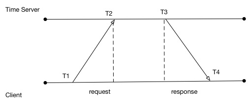
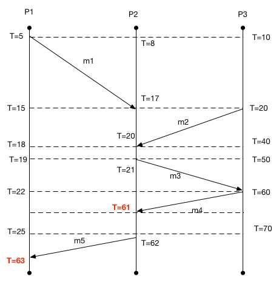

Clocks and Synchronization
==========================

What is Time? Some Physics
--------------------------

- The understanding of time has evolved greatly in the past 150 years.
- With Einstein’s Special and General Relativity Theories, we’ve come to understand: 
	- That time is interwoven with space
	- Time is relative to the reference frame of an observer
	- We now know that simultaneity is a relative concept. Two events A and B occurring simultaneously in one reference frame may appear to be ordered A then B in another frame and B then A in yet another reference frame. 
	- All of this is true without invalidating the observations our causal relationships observed in any reference frame.

.. figure:: figures/clocks/Relativity_of_Simultaneity.*
   
   Two events in space-time. The green observer sees A and B happening at the same time since the two events happen on the same X time plane for A. For the red observer, B is encountered first, then A second. For the blue observer A happens first, and B second. (Image taken from http://commons.wikipedia.org/wiki/File:Relativity_of_Simultaneity.* under the Creative Commons License.)

Time and Computation
--------------------

- This dive into physics is not so much to give a lesson in physics, but to impress upon you the underlying complexity of something most people take for granted every day.
- In a similar fashion, in computation, the concept of time measurement can be very complicated
- When building a distributed system, do not take it for granted that you can simply trust the clock on the machine that is executing your code.
- More complicated solutions are needed to establish the order of events that have occurred or when they will occur in the future.

Physical Clocks
---------------

- Computer Timer: an integrated circuit that contains a precisely machined quartz crystal. When kept under tension the quartz crystal oscillates at a well-defined frequency.
- Clock Tick: after a predefined number of oscillations, the timer will generate a clock tick. This clock tick generates a hardware interrupt that causes the computer’s operating system to enter a special routine in which it can update the software clock and run the process scheduler.
- This system is fairly reliable on one system. With the timer we can define:
	- simultaneous: all actions that happen between clock ticks
	- before: an operation that happens in a previous clock tick
	- after: an operation that happens in a subsequent clock tick

Physical Clocks - Multiple Systems
------------------------------------

- Unfortunately, it is impossible for each machined quartz crystal in every computer timer to be exactly the same. These differences create clock skew.
- For example, if a timer interrupts 60 times per second, it should generate 216,000 ticks per hour.
- In practice, the real number of ticks is typically between 215,998 and 216,002 per hour. This means that we aren’t actually getting precisely 60 ticks per second.
- We can say that a timer is within specification if there is some constant p such that:

.. math::

	1 - p <= \frac{dC}{dT} <= 1 + p

- The constant p is the maximum drift rate of the timer.
- On any two given computers, the drift rate will likely differ.
- To solve this problem, clock synchronization algorithms are necessary.

Clock Synchronization
------------------------------------

- The common approach to time synchronization has been to have many computers make use of a time server.
- Typically the time server is equipped with special hardware that provides a more accurate time than does a cheaper computer timer
- The challenge with this approach is that there is a delay in the transmission from the time server to the client receiving the time update.
- This delay is not constant for all requests. Some request may be faster and others slower.
- So how do we solve this problem?

- The relative time correction C can be calculated as:

.. math:: 

	C = \frac{(T_2 - T_1) + (T_3 - T_4)}{2}

- The way this works is that the client sends a packet with :math:`T_1` recorded to the time server. The time server will record the receipt time of the packet :math:`T_2`. When the response is sent, the time server will write its current time :math:`T_3` to the response. When the client receives the response packet, it will record :math:`T_4` from its local clock. 
- When the value of C is worked out, the client can correct its local clock
- The client must be careful. If the value of C is positive, then C can be added to the software clock
- If the value of C is negative, then the client must artificially decrease the amount of milliseconds added to its software clock each tick until the offset is cleared.
- It is always inadvisable to cause the clock to go backwards. Most software that relies on time will not react well to this.

Clocks Synchronization and Reliability
--------------------------------------

- Always remember: the goal of clock synchronization is to minimize the difference between the accepted actual time and the time on a given client machine
- When this is achieved, it can be said that in a given set of computers that synchronize that their clocks are more closely in sync.
- Even in this case of more accurate and more often corrected for clocks, developers of distributed systems should still be wary of relying on local clock time.
- Because there are corrections going on, the time recorded for an event might have actually happened at a different time on another computer because of differing drift rates of those computer timers.
- Because we have correction of time does not mean that all machines agree on time, it just means they are much closer to each other on average.
- For some distributed systems, this may be sufficient, for others it may not be.

Lamport’s Logical Clocks
------------------------

- An important paper to read - “Time, clocks, and the ordering of events in a distributed system” by Lamport (1978).
- This paper can be looked up on scholar.google.com
- The important contribution of Lamport is that in a distributed system, clocks need not be synchronized absolutely. 
- If two processes do not interact, it is not necessary that their clocks be synchronized because the lack of synchronization would not be observable and thus not cause problems.
- It is not important that all processes agree on what the actual time is, but that they agree on the order in which events occur.
- Rules of Lamport’s Logical Clocks:
	- Defines a relationship called “happens-before”. :math:`a` -> :math:`b` is read as “a happens before b”
	- if :math:`a` and :math:`b` are events in the same process and :math:`a` occurs before :math:`b`, then :math:`a` -> :math:`b` is true.
	- if :math:`a` is the event of a message being sent by one process and :math:`b` is the event of the message being received by another process, then :math:`a` -> :math:`b` is true
	- “happens-before” is transitive, meaning if :math:`a` -> :math:`b` and :math:`b` -> :math:`c`, then :math:`a` -> :math:`c`
	- if :math:`a` -> :math:`b` happens between two process, and events :math:`x` and :math:`y` occur on another set of processes and these two sets of processes don’t exchange messages then:
		- we cannot say whether :math:`x` -> :math:`y` or :math:`y` -> :math:`x` from the perspective of the first set of processes

Implementing Lamport’s Logical Clocks
-------------------------------------

- When a message is transmitted from P1 to P2, P1 will encode the send time into the message.
- When P2 receives the message, it will record the time of receipt
- If P2 discovers that the time of receipt is before the send time, P2 will update its software clock to be one greater than the send time (1 milli second at least)
- If the time at P2 is already greater than the send time, then no action is required for P2
- With these actions the “happens-before” relationship of the message being sent and received is preserved.

Limitations of Lamport’s Logical Clocks
---------------------------------------

- Lamport’s logical clocks lead to a situation where all events in a distributed system are totally ordered. That is, if :math:`a` -> :math:`b`, then we can say :math:`C(a) < C(b)`.
- Unfortunately, with Lamport’s clocks, nothing can be said about the actual time of a and b. If the logical clock says :math:`a` -> :math:`b`, that does not mean in reality that a actually happened before b in terms of real time.

	From this diagram, we can see that :math:`m_1 -> m_3`. We also know that :math:`C(m_1) < C(m_3)`. We can see that :math:`m_2 -> m_3` and that :math:`C(m_2) < C(m_3)`. What we cannot tell here is whether :math:`m_1` or :math:`m_2` caused :math:`m_3` to be sent.

- The problem with Lamport clocks is that they do not capture causality.
- If we know that a -> c and b -> c we cannot say which action initiated c.
- This kind of information can be important when trying to replay events in a distributed system (such as when trying to recover after a crash).
- The theory goes that if one node goes down, if we know the causal relationships between messages, then we can replay those messages and respect the causal relationship to get that node back up to the state it needs to be in.

Vector Clocks
-------------

- Vector clocks allow causality to be captured
- Rules of Vector Clocks:
	- A vector clock :math:`VC(a)` is assigned to an event a
	- If :math:`VC(a) < VC(b)` for events a and b, then event a is known to causally precede b.
- Each Process :math:`P_i` maintains a vector :math:`VC_i` with the following properties:
	- :math:`VC_i[i]` is the number of events that have occurred so far at :math:`P_i`. i.e. :math:`VC_i[i]` is the local logical clock at process :math:`P_i`
	- If :math:`VC_i[j] = k` then :math:`P_i` knows that :math:`k` events have occurred at :math:`P_j`. It is thus :math:`P_i`'s knowledge of the local time at :math:`P_j`

Implementing Vector Clocks
--------------------------

- The first property of the vector clock is accomplished by incrementing :math:`VC_i[i]` at each new event that happens at process :math:`P_i`
- The second property is accomplished by the following steps:
	#. Before executing any event (sending a message or some internal event), :math:`P_i` executes :math:`VC_i[i]` <- :math:`VC_i[i] + 1`
	#. When process :math:`P_i` sends a message :math:`m` to :math:`P_j`, it sets m's (vector) timestamp :math:`ts(m) = VC_i`
	#. Upon receiving a message :math:`m`, process :math:`P_j` adjusts its own vector by setting :math:`VC_j[k]` <- :math:`max( VC_j[k], ts(m)[k] )` for each k.

So... What Did We Get Out of All of This?
-----------------------------------------

- We can say if an event :math:`a` has a timestamp :math:`ts(a)`, then :math:`ts(a)[i]-1` denotes the number of events processed at :math:`P_i` that causally precede :math:`a`
- This means that when :math:`P_j` receives a message from :math:`P_i` with timestamp :math:`ts(m)`, it knows about the number of events that occured at :math:`P_i` that causally preceded the sending of :math:`m`
- Even more importantly, :math:`P_j` has been told how many events in **other** processes have taken place before :math:`P_i` sent message :math:`m`.
- So, this means we could achieve a very important capability in a distributed system: we can ensure that a message is delivered only if all messages that causally precede it have also been received as well.

- We can use this capability to build a truly distributed dataflow graph with dependencies without having a centralized coordinating process.

