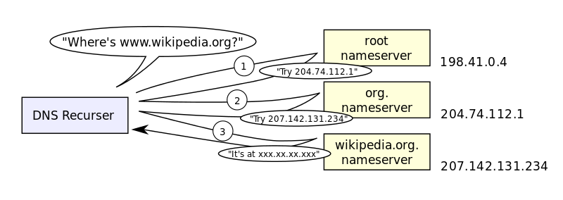

Domain Name Service
==========================

What is DNS ?
-------------
 - DNS is a hierarchal, decentralized naming system for computers, services, and resources connected to or not connected to the internet.
 - DNS implementations can reside on LANs or at internet scale

Types of DNS Records
--------------------
 - A Records: host name to ip address record
 - MX Records: records of host names and IP addresses of SMTP mail exchangers
 - NS Records:
 - PTR Records: records for reverse DNS lookups. To translate ip addresses to host names 

History of DNS
--------------
 - Original IP-address to host name translations were maintained in a text file on each host that was named hosts.txt. This approach still exists on Linux, Windows, and similar PC and server systems. This approach is still somewhat useful on statically addressed small networks that don’t implement dynamic network discovery services.
 - The IP address and host names were managed by 1-2 people from the 1970s to the early 1980s
 - In the early 1980s, Mockapetris created the original DNS system. Soon after, the IETF (Internet Engineering Task Force) published RFC 882 and 883 to document the protocols and capabilities of DNS
 - In 1984, UC Berkley students implemented the first UNIX based DNS server called BIND. This system was ported to Windows NT in the early 1990s
 - Currently, BIND is one of the most widely used DNS platforms used on the internet.
 - In subsequent years and decades, standards groups and researchers proposed and implemented new record types, improved security, and scaling of the DNS system as the internet itself expanded.

Top Level Domains
-----------------

 - A TLD is the right-most section of a internet address. For example, google.com’s TLD is .com, Luc.edu’s TLD is .edu
 - Originally, there were very few TLDs. These included .arpa, .org, .com, .net, .nato
 - Soon after, national / regional specific TLDs came into existence such as .dd for East Germany, or .us for America
 - In the 2000s, ICANN introduced many new TLDs, and in the 2010’s 1000s of new TLDs were introduced
 - TLDs are arbitrary and controlled by ICANN, the group that manages the Internet’s root DNS servers. In an isolated network or in your own LAN, you can create your own TLDs, but they will only be respected within your own network.

DNS and Its Hierarchies
-----------------------

.. figure:: figures/dns/dns_hierarchy.png

Name Servers
------------

 - The DNS system is a distributed database system.
 - Each node in the database is a name server.
 - Each domain has at least one authoritative DNS server that publishes information about the domain and the name servers of any domains subordinate to it.
 - The top of the hierarchy is served by the root name servers. These servers manage the TLDs

Resolving Addresses
-------------------

 - DNS resolvers perform recursive queries in the hierarchal internet database to resolve these addresses.
 - This kind of recursive query can put a very intense load on hosts that are responsible for records closer to the root. To solve this problem, a caching solution is needed.
 - Nearly all ISPs provide a DNS server that contains a few hours old cache of a large portion of the internet’s DNS records. This cache gets partially invalidated every few hours. This is why when a DNS record is updated on the internet, it can take several hours to propagate through the entire internet.
 - Additionally, most operating systems will locally cache DNS query results for at least several minutes or more.

Enabling Distribution and Load Balancing
----------------------------------------

 - It is possible to configure regional DNS records. This allows an Internet visible web service to be physically hosted around the world and to have DNS queries be resolved to the closest physical server.
 - Additionally, more than one IP address can be configured for a name record to point to. The DNS server, resolver, and caching mechanisms can randomly pick among the addresses sent back. This depends somewhat on client implementations for correctness.
 - Failover MX records. When registering a mail exchanger for a site, it is possible to register multiple mail exchangers for the site with different priorities. Often, larger organizations will have one onsite SMTP server and one offsite SMTP server to allow for better uptime.

Credits
--------
 - Information for this lecture was drawn from:
	- Wikipedia
	- Distributed Systems by Andrew Tanenbaum

