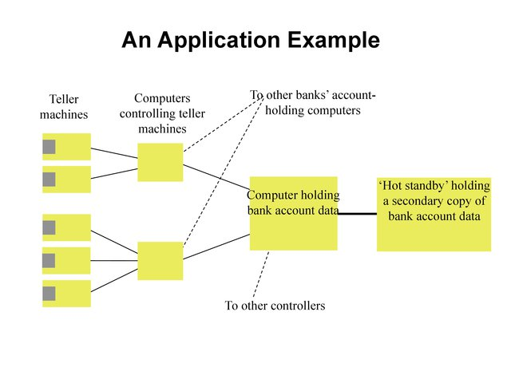

Introduction and Issues
===========================

What is a distributed system?
----------------------------------------------------------

“A collection of autonomous computers linked by a network with software designed to produce an integrated facility”

“A collection of independent computers that appear to the users of the system as a single computer”

Examples
----------------------------------------------------------

Distributed systems

- Department computing cluster
- Corporate systems

Application examples

- Email
- News
- Multimedia information systems- video conferencing
- Airline reservation system
- Banking system

.. figure:: figures/issues/issues-3.jpg
   :scale: 60 %

   A Distributed System

.. figure:: figures/issues/issues-4.jpg
   :scale: 60%

   A Centralized Multi-User System

   An Application Example

Advantages of Distributed Systems vs. Centralized
----------------------------------------------------------

Economics

- Microprocessors have better price/performance than mainframes

Speed

- Collective power of large number of systems

Geographic and Responsibility Distribution

Reliability

- One machine’s failure need not bring down the system

Extensibility

- Computers and software can be added incrementally

Advantages of Distributed Systems vs. Standalones
----------------------------------------------------------

Data Sharing

- Multiple users can access common database, data files

Device/Resource Sharing

- e.g., printers, servers, other CPUs…

Communication

- Communication with other systems…

Flexibility

- Spread workload to different & most appropriate systems 

Extensibility

- Add resources and software as needed

Disadvantages of Distributed Systems
----------------------------------------------------------

Software

- Little software exists compared to PCs (for example) but the 
situation is improving with the cloud.

Networking

- Still slow and can cause other problems (e.g., when disconnected)

Security

- Data may be accessed by unauthorized users

Key Characteristics
----------------------------------------------------------

- Support for resource sharing
- Openness
- Concurrency
- Scalability
- Fault Tolerance (Reliability)
- Transparency

Resource Sharing
----------------------------------------------------------

Share hardware, software, data and information

Hardware Devices

- printers, disks, memory

Software Sharing

- compilers, libraries, toolkits

Data

- databases, files

Resources Must be Managed
----------------------------------------------------------

.. figure:: figures/issues/issues-11.jpg
   :scale: 60%

   Resources Must Be Managed

.. figure:: figures/issues/issues-12.jpg
   :scale: 60%

   Client-Server Model for Resource Sharing

Openness
----------------------------------------------------------

Determines whether the system can be extended in various ways without disrupting existing system and services

Hardware extensions (adding peripherals, memory, communication interfaces..)

Software extensions
  - Operating System features
  - Communication protocols

Mainly achieved using published interfaces, standardization
  - Great example of a distributed, standards-focused effort, http://www.ietf.org/

Open Distributed Systems
----------------------------------------------------------

- Are characterized by the fact that their key interfaces are published

- Based on the provision of a uniform interprocess communication mechanism and published interfaces for access to shared resources

- Can be constructed from heterogeneous hardware and software.

Concurrency
----------------------------------------------------------

- In a single system several processes are interleaved
- In distributed systems - there are many systems with one or more processors
- Many users simultaneously invoke commands or applications (e.g., Netscape..)
- Many server processes run concurrently, each responding to  different client request, e.g., File Server

   Opportunities for Concurrency

Scalability
----------------------------------------------------------

Scale of system

- Few PCs servers --> Dept level systems --> Local area network --> Internetworked systems --->Wide area network…

- Ideally - system and applications software should not (need to) change as systems scales

Scalability depends on all aspects

- Hardware
- Software
- Networks
- Storage

Fault Tolerance
----------------------------------------------------------

- Ability to operate under failure(s) - possibly at a degraded performance level
- Two Approaches
  - Hardware redundancy - use of redundant components
  - Software Recovery - design of programs to recover 
- In distributed systems
  - servers can be replicated
  - databases may be replicated 
  - software recovery involves the design so that state of permanent data can be recovered
- Distributed systems, in general, provide a high(er) degree of availability

Transparency
----------------------------------------------------------

Transparency "is the concealment from the user of the separation of components of a distributed system so that the system is perceived as a whole".

Examples

- Access Transparency - enables local and remote objects to be accessed using identical operations (e.g., read file..)
- Location transparency - location of resources is hidden
- Migration transparency - resources can move without changing names
- Replication Transparency - users cannot tell how many copies exist
- Concurrency Transparency - multiple users can hare resources automatically
- Parallelism Transparency - activities can happen in parallel without user knowing about it 
- Failure Transparency - concealment of 

Are there any forms of transparency that distributed systems researchers haven't already thought of?


Design Issues and Goals
 - Requirements
----------------------------------------------------------

- Openness
- Resource Sharing
- Concurrency
- Scalability
- Fault-Tolerance
- Transparency
- High-Performance

Issues arising from Distributed Systems
----------------------------------------------------------

- Naming - How to uniquely identify resources
- Communication - How to exchange data and information reliably with good performance
- Software Structure - How to make software open, extensible, scalable, with high-performance
- Workload Allocation - Where to perform computations and various services
- Consistency Maintenance - How to keep consistency at a reasonable cost

Naming
----------------------------------------------------------

- A resource must have a name (or identifier) for access
- Name: Can be interpreted by user, e.g., a file name
- Identifier - Interpreted by programs, e.g., port number

Naming - Name Resolution
----------------------------------------------------------

- “resolved” when it is translated into a form to be used to invoke an action on the resource

- Usually a communication identified PLUS other attributes

- E.g., Internet communication id

  - host id:port no
  - also known as “IP address:port no”
  - 192:130.228.6:8000

- Name resolution may involve several translation steps

Naming - Design Considerations
----------------------------------------------------------

- Name space for each type of resource

  - e.g., files, ports, printers, etc.

- Must be resolvable to communication Ids

  - typically achieved by names and their translation in a "name service"
  - You must have come across “DNS” when using the WWW!!

- Frequently accessed resources, e.g., files are resolved by resource manager for efficiency

- Hierarchical Name Space - each part is resolved relative to current context, e.g., file names in UNIX

Communication
----------------------------------------------------------

Communication is an essential part of distributed systems
- e.g., clients and servers must communicate for request and response

Communication normally involved 
- transfer of data from sender to receiver
- synchronization among processes

Communication accomplished by message passing

Synchronous or blocking
- sender waits for receiver to  execute a receive operation

Asynchronous or non-blocking

Types of Communication
----------------------------------------------------------

- Client-Server
- Group Multicast
- Function Shipping

- Performance of distributed systems depends critically on communication performance

- We will study the software components involved in communication

Client-Server Communication
----------------------------------------------------------

- Client sends request to server process
- Server executes the request
- Server transmits a reply and data, e.g., file servers, web server...

.. figure:: figures/issues/issues-29.jpg
   :scale: 60%

   Client-Server Communication

Client-Server Communication
----------------------------------------------------------

- Message Passing Operations

  - send
  - receive

- Remote Procedure Call (RPC)

  - hides communication behind procedure call abstraction
  - e.g., read(fp,buffer,….)
  - Files reside with the server, thus there will be communication between client and server to satisfy this request

Group Multicast
----------------------------------------------------------

- A very important primitive for distributed systems

- Target of a message is a group of processes

  - e.g., chat room, I sending a message to class list, video conference

- Where is multicast useful?

  - Locating objects - client multicasts a message to many servers; server that can satisfy request responds
  - Fault-tolerance - more than one server does a job; even if one fails, results still available
  - Multiple updates

- Hardware support may or may not be available

  - if no hardware support, each recipient is sent a message

.. figure:: figures/issues/issues-32.jpg
   :scale: 60%

   Group Multicast

Software Structure
----------------------------------------------------------

- In a centralized system, O/S manages resources and provides essential services

- Basic resource management

  - memory allocation and protection
  - process creation and processor scheduling
  - peripheral device handling

- User and application services

  - user authentication and access control (e.g., login)
  - file management and access facilities
  - clock facilities

Distributed System Software Structure
----------------------------------------------------------

- It must be easy to add new services (flexibility, extensibility, openness requirements)

- Kernel is normally restricted to

  - memory allocation
  - process creation and scheduling
  - interposes communication
  - peripheral device handling

- E.g., Microkernels - represent light weight O/S, most services provided as applications on top of microkernels

.. figure:: figures/issues/issues-35.jpg
   :scale: 60%

   Distributed System Software Structure

Consistency Management
----------------------------------------------------------

- When do consistency problems arise? 

  - concurrency
  - sharing data
  - caching

- Why cache data?

  - for performance, scalability

- How?

  - Subsequent requests (many of them) need not go over the NETWORK to SERVERS
  - better utilized servers, network  and better response

- Caching is normally transparent, but creates consistency problems

Caching
----------------------------------------------------------

- Suppose your program (pseudocode) adds numbers stored in a file as follows (assume each number is 4 bytes::

   for I= 1, 1000
	  tmp = read next number from file
	  sum = sum + tmp
   end for

- With no caching, each read will go over the network, which will send a new 4 byte number. Assuming 1 millisecond (ms) to get a number, requres a total of 1s to get all of the numbers.

- With caching, assuming 1000 byte pages, 249 of the 250 reads will be local requests (from the cache). 

Consistency
----------------------------------------------------------

- Update consistency

  - when multiple processes access and update data concurrently
  - effect should be such that all processes sharing data see the same values (consistent image)
  - E.g., sharing data in a database

- Replication consistency

  - when data replicated and once process updates it
  - All other processes should see the updated data immediately
  - e.g., replicated files, electronic bulletin board

- Cache consistency

  - When data (normally at different levels of granularity, such as pages, disk blocks, files…) is cached and updates by one process, it must be invalidated or updated by others
  - When and how depends on the consistency models used

Workload Allocation
----------------------------------------------------------

- In distributed systems many resources (e.g., other workstations, servers etc.) may be available for “computing”

- Capacity and size of memory of a workstation or server may determine what applications may are able to run

- Parts of applications may be run on different workstations for parallelism (e.g., compiling different files of the same program)

- Some workstations or servers may have special hardware to do certain types of applications fast (e.g., video compression)

- Idle workstations may be utilized for better performance and utilization

Processor Pool Model
-----------------------------

In a processor pool model, processes are allocated to processors for their lifetime (e.g the
Amoeba research O/S supports this concept).

.. figure:: figures/issues/issues-41.jpg
   :scale: 60%

   Processor Pool Model

Quality-of-Service
----------------------------------------------------------

Quality of Service (a.k.a. QoS) refers to performance and other service expectations of a client or an application.

  - Performance
  - Reliability and availability
  - security

Examples where this is important.

  - Voice over IP (VOIP) and telephony
  - Video (e.g. Netflix and friends)