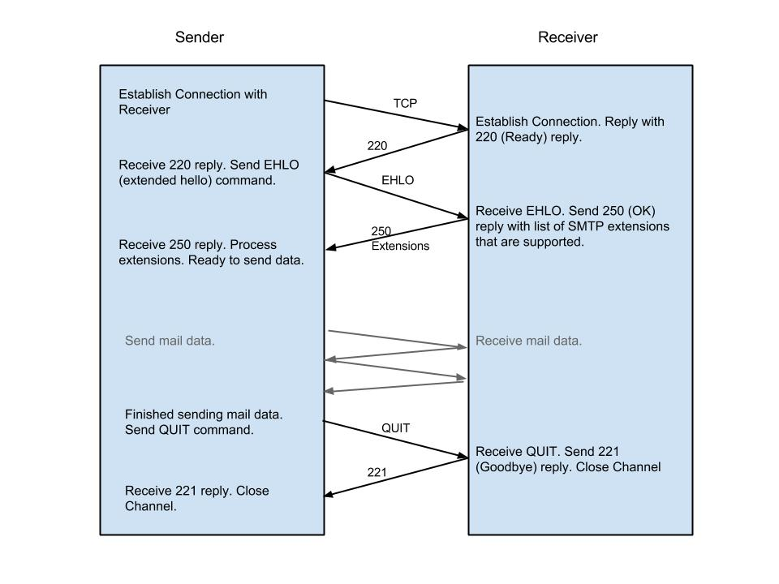
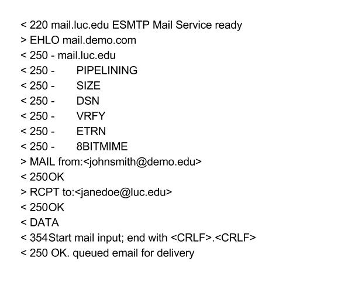

SMTP
======================

Credit
------
 - This lecture was originally written by Sana Fatima. It has been updated to be added to this course’s lecture notes.

What is SMTP?
--------------
A protocol for sending email messages between servers. Most email systems send mail over the Internet using SMTP to send messages from one server to another, the messages can then be retrieved by an email client using POP (post office protocol) or IMAP (internet message access protocol). It is also used to send messages from a mail client to a mail server.

History
--------------

* September 1980, RFC 772. Mail Transfer Protocol (MTP) first defined. Elements borrowed from Telnet and FTP. 
* November 1981, RFC 788. SMTP first defined for the specific purpose of delivering email. 
	
* February 1993, RFC 1425 SMTP Service Extensions published. In this standard:
		* Process for adding new capabilities to extend how SMTP works (Extended SMTP).
		* Maintains backward-compatibility with existing systems.
* January 1996, RFC 1891. Delivery status notification extension
* September 2000, RFC 2920. Command pipelining extension
* April 2001, RFC 2821. Current base standard for SMTP

SMTP Process
--------------

First you send an email from a stand-alone client. The client connects to your local SMTP server using port 25. The client has a conversation with the server, telling the server the address of the sender and recipients, and sending the message.

The server takes the TO address and breaks it into the recipient name and the domain name. If the email was intended for someone with the same domain name then it will hand the message to the POP3 server. If the recipient is at another domain than SMTP needs to communicate with the server at that domain.

The SMTP server uses DNS to retrieve the IP address for the recipient domain and connects with that server using port 25. A conversation, like the previous one with the client, is held with the SMTP receiver server and the email is sent. The receiver server recognizes the domain name is local and hands the message off to the POP3 server, which will place the message in the recipient’s mailbox.

If the sending server can’t connect with the receiving server than the message goes into a queue. The server will periodically try to resend the messages in its queue until it reaches a timeout and sends a failure notification.  

SMTP Model
--------------

* Sender’s client machine → sender’s local SMTP server → recipient’s local SMTP server → recipient’s local host
* Relaying
	* Absence of DNS made electronic mail delivery complex.
	* SMTP routing information had to be included along with the e-mail address.
	* Routing information specified the SMTP servers that the mail had to be relayed through in order to reach its destination.
	* This early process was inconvenient: requiring many devices to handle the mail, resulting in delays, and requiring communication of source routes between servers.
* Direct Email Communication (preferred method)
	* Utilizes DNS
		* Support for mail exchanger (MX): record that allows mapping of domain name to IP address of the SMTP server.
	* Sender SMTP server can make a connection to directly send the message to the receiver’s SMTP server.
	* Direct email delivery is faster and more efficient. 
	* SMTP is used for the transfer between the sender’s client to it’s local SMTP server and the transfer between that SMTP server to the recipient’s local SMTP server. Retrieval of email by the recipient is done using POP or IMAP. 
	* Each email transfer requires establishing a TCP connection and then sending the email headers and body using the SMTP mail transaction process. 

Establishing a Connection
----------------------------

* Using TCP to ensure efficient and reliable communication.
* SMTP servers must be available 24/7 to allow mail to be delivered at any time. 
	* This is why end-users use other protocols to retrieve an email over running their own SMTP servers.
* Server listens on well known port 25 for TCP connection requests from other servers.
* Communication is similar to FTP.
	* SMTP commands are sent as plain ASCII text over the TCP connection. 

* Commands and Replies
	* EHLO (extended hello) command includes the domain name of the sender as a parameter. Sent to greet a SMTP receiver and ask for a list of extensions it supports. 
	* 220 greeting reply includes server name.
	* 250 reply states successful execution of command.
	* 221 quitting reply includes server name.

* Shows some supported extensions
	* 8BITMIME: 8-bit content transfer encoding type in MIME.
	* SIZE: Message size declaration.
	* PIPELINING: multiple commands can be sent in groups instead of the command/reply format.
	* ETRN: extended Turn.
	* VRFY: checks if email address is valid.

SMTP Mail Transaction Process
--------------------------------

* Transaction Initiation and Sender Identification
	* Sender tells receiver it wants to start sending message
	* Sender gives the email address of the message sender
* Recipient Identification
	* Sender gives the email address(es) of the recipients of this email
* Mail Transfer
	* Sender transfers email message according to the RFC 2822 specification, for message format. 
* Why isn’t it just a single step? 
	* Separation of the sender and recipient information from the message.
	* Gives SMTP receiver the information up front.
	* Greater control on distribution.
	* Allows for easier security implementation

	
.. figure:: figures/smtp/smtpTransaction.jpg

* 3 command/reply sequences
	* Sender identified using MAIL command
	* Each Recipient identified with one RCPT command
	* Message transferred with the DATA command

SMTP Features
--------------

* Relaying
* Forwarding: SMTP server will accept an email for a nonlocal host and forward it. Similar to relaying but it is used for a different purpose.
* Address Debugging: VRFY (verify) command used to check validity of email address.
* Mailing List Expansion: EXPN (expand) command
* Failure response: if initial attempt doesn’t go through the server will periodically retry to send the email until it reaches a timeout, returning a failure message. 

SMTP Security
--------------

* Base protocol doesn’t include security features.
* SMTP servers implement security features.
* IP address check of the device attempting to connect to the server. 
* Restriction of certain features, such as relaying.
* Limit use of the EXPN command to prevent unauthorized users from getting the email addresses.
* Checking validity of sender email address.
* Refusing the message if recipient’s address is not a local mailbox.
* Limiting the size or number of emails sent in a given time.
* Logging server access.

