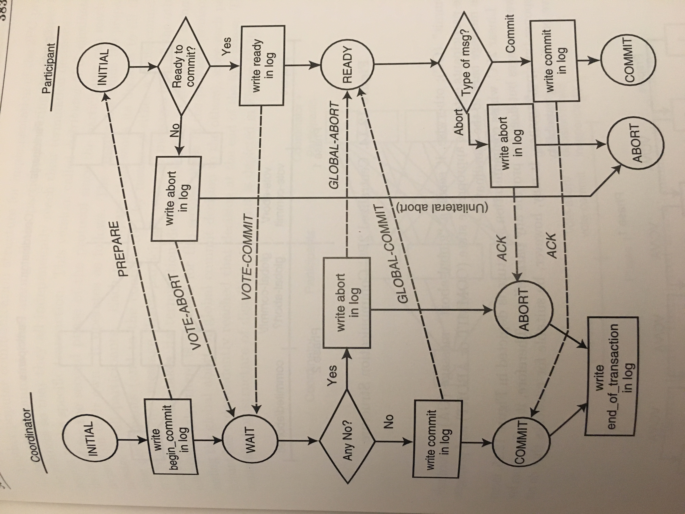

Distributed Transactions
=========================

Transactions Defined
---------------------

 - A transaction is a unit of reliable and consistent computation.
 - A sequence of read and write operations on a database that happen entirely or not at all.
 - Transactions may or may not be repeatable or isolated.

ACID
----

 - ACID = Atomicity, Consistency, Isolation, Durability
 - Atomicity requires that each transaction be “all or nothing”. i.e. if one part of a transaction fails, then the entire transaction fails and the database remains unchanged w.r.t. the actions in the transaction
 - Consistency requires that the pre-state and post-state of a transaction on a database be valid. Typically this refers to having all constraints on the data structures in the database be valid.
 - Isolation. This refers to the degree of serializability. Providing maximum isolation for concurrent transactions would have an equivalent post-state as running all transactions in serial.
 - Durability. This ensures that once a transaction has been committed that it will remain committed, even in the event of some crash or power-loss.

Isolation Levels - Serializable
-------------------------------

 - Transactions are guaranteed to be serializable w.r.t. each other. This means that the post state of two concurrent transactions would be the same as if they were executed in serial (one after the other) fashion.
 - There are many algorithms for determining serializability and implementing either pessimistic or optimistic locks to achieve serializable isolation within a single database host.
 - Read, write, and range-locks are kept for the duration of a transaction.

Isolation Levels - Repeatable Reads
-----------------------------------

 - Read and write locks are kept for the duration of the transaction, but range-locks are not kept.
 - This allows for phantom reads.
 - This means that for example in Transaction A, executing the same query twice in a row will not produce the same results within Transaction A if there is some Transaction B that adds values within the range.
 - Example (Transaction A)

 ::

	set transaction isolation level repeatable read 
	begin tran t1
	select * from users where age between 10 and 30
	select * from users where age between 10 and 30
	commit tran t1;

 - Example (Transaction B)

 ::
	
	set transaction isolation level repeatable read
	begin tran t1
	insert into users(id,name,age) values(3, ‘bob’, 27)
	commit tran t1

 - In this example, the first query in Transaction A if timed properly with Transaction B would produce different results compared to the second query.

Isolation Levels - Read Committed
---------------------------------

 - Write locks are kept for the duration of the transaction, but read locks and range locks are not kept.
 - Basically, this guarantees that any data that is read has been previously committed. You will not see any intermediate, uncommitted writes from another transaction.
 - Subsequently issued reads will not be guaranteed to get the same data as other transactions may have committed during that time.
 - Written data will be consistently re-readable though.

Isolation Levels - Read Uncommitted
-----------------------------------

 - This is the lowest isolation level
 - Dirty reads are allowed. One transaction may see not-yet-committed changes made by other transactions

Isolation Levels - Mixing Levels
--------------------------------

 - If two transactions run concurrently, they run under the highest isolation level.
 - For example, if one transaction runs “read committed” and another runs “read uncommitted” at the same time over the same data, then both transactions will run under “read committed” isolation.
 - If this were not the case, then higher isolation levels would not be able to make their guarantees.

Distributed Commit Algorithms 
-----------------------------

 - Distributed commit algorithms are also known as “Distributed Reliability Protocols”, but not commonly
 - The two most commonly used algorithms are 2PC and 3PC
 - The coordination of distributed transactions is often a separate service. In Microsoft Windows, this is called the “Distributed Transaction Coordinator”.
 - In the .NET framework, distributed transactions are available in the System.Transactions assembly, and the main class that plugs into OLEDB and ADO.NET database access drivers is called TransactionScope
 - Other RDBMS systems come with their own services or have them built into the RDBMS engine itself.

2PC - Two Phase Commit
----------------------

 - The workflow of a Two Phase Commit:

