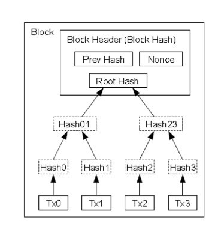
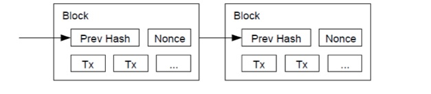

BlockChain
==========

Each block of coins contains every transaction ever made by that currency.

Block
-----

Each Block contains three things:

Header
------
The header of the last block. New headers must be generate under this header. The Headers are generated from the Merkle Hash Algorithm:

Magic Number
------------

- 4 bytes
- Value always 0xD9B4BE5

Blocksize
---------

-4 bytes
-Number of bytes following up to the end of the block

Transaction Counter

-positive integer VI = VarInt
-1-9 bytes

Transactions
------------

- The list of transactions

Here is a list of the blocks found: http://blockexplorer.com/

It is not distributed so we only need enough detail to 
understand mining and the transaction process.

Simple C Code to generate a block
---------------------------------

.. code-block:: c

   /*
   #Copyright (c) 2011, Joseph Matheney
   #All rights reserved.
 
   #Redistribution and use in source and binary forms, with or without modification, are permitted provided that the following conditions are met:
 
   #    Redistributions of source code must retain the above copyright notice, this list of conditions and the following disclaimer.
   #    Redistributions in binary form must reproduce the above copyright notice, this list of conditions and the following disclaimer in the documentation and/or other materials provided with the distribution.
 
   #THIS SOFTWARE IS PROVIDED BY THE COPYRIGHT HOLDERS AND CONTRIBUTORS "AS IS" AND ANY EXPRESS OR IMPLIED WARRANTIES, INCLUDING, BUT NOT LIMITED TO, THE IMPLIED WARRANTIES OF MERCHANTABILITY AND FITNESS FOR A PARTICULAR PURPOSE ARE DISCLAIMED. IN NO EVENT SHALL THE COPYRIGHT HOLDER OR CONTRIBUTORS BE LIABLE FOR ANY DIRECT, INDIRECT, INCIDENTAL, SPECIAL, EXEMPLARY, OR CONSEQUENTIAL DAMAGES (INCLUDING, BUT NOT LIMITED TO, PROCUREMENT OF SUBSTITUTE GOODS OR SERVICES; LOSS OF USE, DATA, OR PROFITS; OR BUSINESS INTERRUPTION) HOWEVER CAUSED AND ON ANY THEORY OF LIABILITY, WHETHER IN CONTRACT, STRICT LIABILITY, OR TORT (INCLUDING NEGLIGENCE OR OTHERWISE) ARISING IN ANY WAY OUT OF THE USE OF THIS SOFTWARE, EVEN IF ADVISED OF THE POSSIBILITY OF SUCH DAMAGE.
   */
 
   #ifdef fail
        #!/bin/bash
        # NOTE you can chmod 0755 this file and then execute it to compile (or just copy and paste)
        gcc -o hashblock hashblock.c -lssl
        exit 0
   #endif
 
   #include <openssl/sha.h>
   #include <stdio.h>
   #include <string.h>
   #include <stdlib.h>
 
   // this is the block header, it is 80 bytes long (steal this code)
   typedef struct block_header {
        unsigned int    version;
        // dont let the "char" fool you, this is binary data not the human readable version
        unsigned char   prev_block[32];
        unsigned char   merkle_root[32];
        unsigned int    timestamp;
        unsigned int    bits;
        unsigned int    nonce;
   } block_header;
 
 
   // we need a helper function to convert hex to binary, this function is unsafe and slow, but very readable (write something better)
   void hex2bin(unsigned char* dest, unsigned char* src)
   {
        unsigned char bin;
        int c, pos;
        char buf[3];
 
        pos=0;
        c=0;
        buf[2] = 0;
        while(c < strlen(src))
        {
                // read in 2 characaters at a time
                buf[0] = src[c++];
                buf[1] = src[c++];
                // convert them to a interger and recast to a char (uint8)
                dest[pos++] = (unsigned char)strtol(buf, NULL, 16);
        }
       
   }
 
   // this function is mostly useless in a real implementation, were only using it for demonstration purposes
   void hexdump(unsigned char* data, int len)
   {
        int c;
       
        c=0;
        while(c < len)
        {
                printf("%.2x", data[c++]);
        }
        printf("\n");
   }
 
   // this function swaps the byte ordering of binary data, this code is slow and bloated (write your own)
   void byte_swap(unsigned char* data, int len) {
        int c;
        unsigned char tmp[len];
       
        c=0;
        while(c<len)
        {
                tmp[c] = data[len-(c+1)];
                c++;
        }
       
        c=0;
        while(c<len)
        {
                data[c] = tmp[c];
                c++;
        }
   }
 
   int main() {
        // start with a block header struct
        block_header header;
       
        // we need a place to store the checksums
        unsigned char hash1[SHA256_DIGEST_LENGTH];
        unsigned char hash2[SHA256_DIGEST_LENGTH];
       
        // you should be able to reuse these, but openssl sha256 is slow, so your probbally not going to implement this anyway
    SHA256_CTX sha256_pass1, sha256_pass2;
 
 
        // we are going to supply the block header with the values from the generation block 0
        header.version =        1;
        hex2bin(header.prev_block,              "0000000000000000000000000000000000000000000000000000000000000000");
        hex2bin(header.merkle_root,             "4a5e1e4baab89f3a32518a88c31bc87f618f76673e2cc77ab2127b7afdeda33b");
        header.timestamp =      1231006505;
        header.bits =           486604799;
        header.nonce =          2083236893;
       
        // the endianess of the checksums needs to be little, this swaps them form the big endian format you normally see in block explorer
        byte_swap(header.prev_block, 32);
        byte_swap(header.merkle_root, 32);
       
        // dump out some debug data to the terminal
        printf("sizeof(block_header) = %d\n", (int) sizeof(block_header));
        printf("Block header (in human readable hexadecimal representation): ");
        hexdump((unsigned char*)&header, sizeof(block_header));
 
        // Use SSL's sha256 functions, it needs to be initialized
    SHA256_Init(&sha256_pass1);
    // then you 'can' feed data to it in chuncks, but here were just making one pass cause the data is so small
    SHA256_Update(&sha256_pass1, (unsigned char*)&header, sizeof(block_header));
    // this ends the sha256 session and writes the checksum to hash1
    SHA256_Final(hash1, &sha256_pass1);
       
        // to display this, we want to swap the byte order to big endian
        byte_swap(hash1, SHA256_DIGEST_LENGTH);
        printf("Useless First Pass Checksum: ");
        hexdump(hash1, SHA256_DIGEST_LENGTH);
 
        // but to calculate the checksum again, we need it in little endian, so swap it back
        byte_swap(hash1, SHA256_DIGEST_LENGTH);
       
    //same as above
    SHA256_Init(&sha256_pass2);
    SHA256_Update(&sha256_pass2, hash1, SHA256_DIGEST_LENGTH);
    SHA256_Final(hash2, &sha256_pass2);
       
        byte_swap(hash2, SHA256_DIGEST_LENGTH);
        printf("Target Second Pass Checksum: ");
        hexdump(hash2, SHA256_DIGEST_LENGTH);
 
        return 0;
   } 

Once a block is generated it is added to the chain of blocks that preceds it, and it becomes eligable for transaction.

The BlockChain is a series of blocks that are tied together in series. Here is the original image from Nakamoto’s paper:

