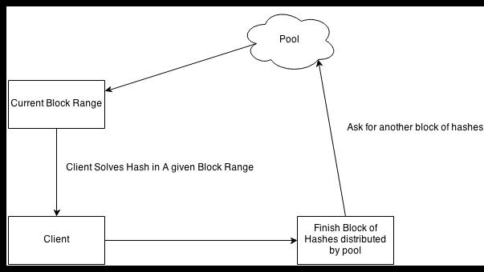

Mining
======

Tools
-----

There are multiply mining tools in existance.

Mining requires powerful hardware and a large number of cores.

As more blocks are found it becomes harder to find a hash below the current block thus requiring more computational power

Pooled Mining
--------------

Pooled mining is when users work together to find blocks, and use distributed clients to find more BitCoins.

- Requires a mining client and a pool to join.
- A comparison of mining pools can be found here: https://en.bitcoin.it/wiki/Comparison_of_mining_pools

One of the better mining tools is cgminer which is available as a command line tool.

-Point cgminer to the pool to begin mining.
-Once a share is found earnings are distributed amongst users of the mining pool.
-Cgminer is mostly built in C and code can be found here: https://github.com/fcicq/cgminer

