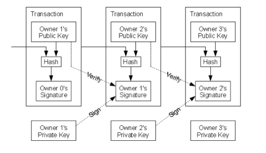

Transactions
============

Wallet
------

Each user gets a wallet which stores their bitcoins and holds an address 
to which other users can send bitcoins. Transactions use a process similar to PGP
to form a transaction. Before coins are sent to someone else's address they are 
signed with the users address and sent over. This ensures safety and adds to the legitamacy of the
transaction.

Transactions
------------

(Figure from original Satoshi Nakamoto Paper)

Each owner of a BitCOin gets a Public Key and a Private Key. Both clients must agree on the amount that is being sent over the network, and once the receiver receives the amount agreed upon the transaction is set and added to the BlockChain. Transactions often contain fees, and if the amount sent is less than the amount received this is recognized as a fee for the transaction.

The transaction process is P2P and the Clients agree on the amount specified. BitCoins can be broken down into pieces, and small amounts of money can be shared over the network. All Coins are sent between public encryption addresses such as this one: 18Ze1socHEYvywfA9QgZjE1MSrV8ZgoQZH

The value of BitCoin is incredible volatile and has been known to fluctuate by hundreds of dollars in a given day. There is an exchange rate between USD and BitCoin that on the date of this article (11/18/2013) is around $730.

