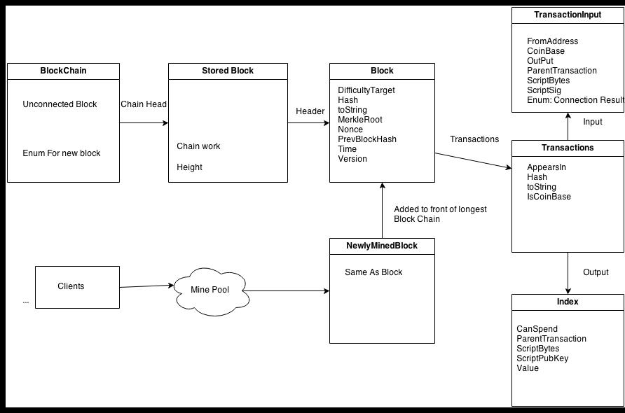
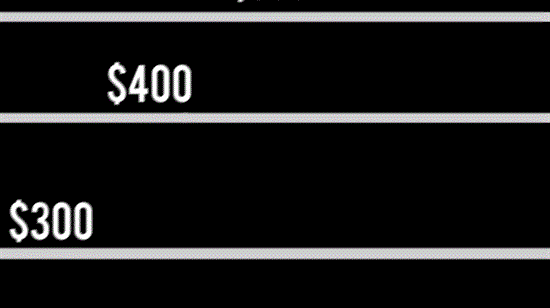

Final Software Diagram
======================

Works Cited
------------

“Design and security analysis of Bitcoin infrastructure using application deployed
on Google Apps Engine.” Piotr "ThePiachu" Piasecki,6/6/2012, 11/15/2013

“Bitcoin: A Peer-to-Peer Electronic Cash System.” Satoshi Nakamoto 11/15/2013

Senate Hearing 11/18
--------------------

The Senate Held a panel that largely endorsed BitCoin as a legitamate  currency with real long term potential. The value of BitCoin skyrocketed.
 
I Guess we will see how this goes…

