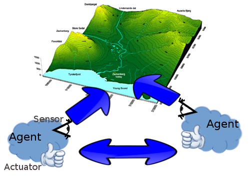
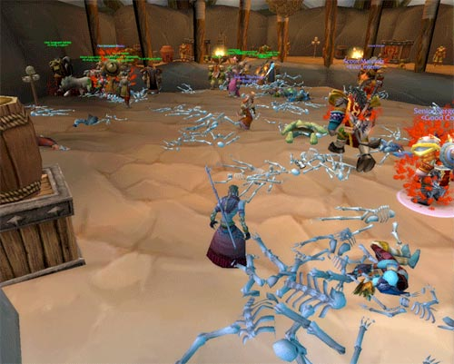

.. Multi-agents Systems documentation master file, created by
   sphinx-quickstart on Sat Oct 19 14:38:02 2013.
   You can adapt this file completely to your liking, but it should at least
   contain the root `toctree` directive.

Intelligent agents in Distributed Systems
================================================

Multi-Agents 
------------

Multi-Agent Systems are systems composed by a number of agents interacting through an environment. Therefore it covers anything from computer interacting in a network to the financial market. Here we will try to focus on the distributed aspect of those systems and also it's applications in Computer Science.

Now that we know what is a Multi-Agent System (MAS) we need to explain what an agent is. An agent have the following properties:
    * It have some degree of autonomy
    * It must be decentralized
    * It have a limited view/understanding of the world (local view)
    * It might be purposeful
        * If an agent doesn't seek a goal we call it a passive agent
        * If the agent have a goal we call it an active agent
            * Active agents can be clustered as rationals if they always act optimally or irrationals if they don't. 
            * A purposeful agent might follow simple reasoning rules or complex reasoning calculations, or even be behavioral (act in a more natural way)

There is a concept that have a considerable intersection with MAS that is Agent-Based Models (ABM). ABM's are models of systems involving many agents, usually those agents follow simple rules (thanks to the *KISS* way of thinking, Keep It Simple Stupid!). The biggest difference here is that ABM are used to understand complex behavior that comes from simple pieces working together, those models are created to understand a phenomena while MAS are created to solve some problem.

Applications
------------

Multi-agent system have applications in many fields. In science we usually work with ABM, because we try to explain certain phenomena and predict others. In engineering we use MAS to create all kind of solutions. Internet and any computer network can be seen as a multi-agent system as long it is not a single process monopolizing the machines.

Multi-Agent Systems aren't restricted only to the Computer Science domain, it is also sedimented in other fields of knowledge like Economics, Ecology, Logic and even Social Sciences.

Virtues
-------

Multi-Agent Systems have some intrinsic advantages over monolithic systems (system with only one agent):
    * Scalable
    * Usually fast self-recovery and fault tolerance due to the redundancy of the components
    * This kind of systems also tend to be flexible, because it's easy to add or modify an agent.
    * Self-organization and self-steering (even with simple agents)
    * When talking about simulation, it's parallel and/or distributed implementation is usually  straight forward

This kind of systems tend to find the best solution, for its problems like a physical phenomena that always goes to a minimum energy state. With this concept and some Artificial Intelligence, developing complex dynamic self-adaptable systems is not like building a complex machine from its very scratch anymore, but like growing a garden.

Drawbacks
---------

It can be processing intensive, and not all problems are easily seen as multi-agent problems. Moreover some systems can become complex and lead us to some unpredictable results (See the Corrupted Blood Incident bellow). Those systems usually reach an equilibrium (whether dynamic or static) and depending on the size of the system an undesired equilibrium can be hard to change.

You might notice that MAS is a representation much more close to our world than what we have done so far,  although it can be a virtue (cause allow us to better understand our environment) it is a problem due the complexity the system can achieve.

Artificial intelligence, problems approached with this concept
--------------------------------------------------------------
Classic Artificial Intelligence doesn't deal with the "social" aspect of agents. In the classic view there is just the agent and the outside world, thus we just concern about creating an agent to perform a specific task. When concerning about MAS we don't care seek to create an agent who interact with the world, instead we try to design an entire society of agents that work on the same environment and can cooperate or compete. Currently some problems are being faced with MAS:

    * Automobiles steering
    * Automated exploration
    * Data mining
    * Semantic Web or "data web"
    * Web of things

How to implement this?
----------------------
Each system have its own features and resources needs, it is necessary to cluster all this multitude of system in order to find general tools to facilitate MAS developing. We have many languages out there, and agent oriented programming is growing fast, but we still need a more robust and general framework and test units for developing multi-agents systems in a consistent and industrial way.

We can label any technology in one of the following "maturity state":
    * Prototype: beginning, the technology is experimental and hard to understand
    * Industry: many resources and knowledge about this technology is available, efforts are focused on making it work consistently
    * Scale: this technology works well and are easy to use, efforts are concentrated in making it work better and in more versatile way

Nowadays we are in the Prototype state concerning about MAS and ABM. Usually researchers use an ad hoc approach, what is time consuming and unnecessary complicated. An effort in making standardized frameworks for MAS developing (we need more than one because MAS is a umbrella term and we need frameworks that target more specific classes of models) would lead us to a better understanding of the capabilities of those systems and to a completely new way of thinking about those creations.

.. What programing languages have been developed to implement those concepts
   -------------------------------------------------------------------------

.. Contributions from other sciences (besides computer science)
   ------------------------------------------------------------

Complex and unexpected behavior - The Corrupted Blood Incident
--------------------------------------------------------------

On September 13, 2005 an mortal disease caused by Hakkar's curse spread out of control devastating the biggest towns in Azeroth, World of Warcraft, the worldwide MMORPG. It was caused by a bug, the disease was intended to kill the players characters in a specific area (Zul'Gurub) but due it's easy to spread and the fact that minions and pets could be infected the disease went out of control.

Many epidemiologists think it was an interesting (although accidental) study case, because the current models use mathematical rules to simulate human behavior, what is not so accurate. In this event we were able to see that many players with healing abilities volunteered to help the infected ones, some players (afterwards called the World of Warcraft terrorists) found creative ways to spread the disease faster and thus cause even more destruction.

It is an awesome example of how a small change in a Multi-Agent System can lead to a instability situation, not due to the program but due to the system itself. The bug didn't escape out of control due to a player (human) interference but due the non-players characters itself.

.. Example of cool application - Semantic Web
   ------------------------------------------
   The Web of Data, opposing term to Web of Document (current Internet).

Bibliography
============

#. http://www.springer.com/computer/swe/book/978-0-387-24568-3
#. Niazi, Muaz; Hussain, Amir (2011). "Agent-based Computing from Multi-agent Systems to Agent-Based Models: A Visual Survey"
#. "Amazon.com: Artificial Intelligence: A Modern Approach (3rd Edition) (9780136042594)"
#. http://multiagent.com/p/fundamentals-of-multiagent-systems.html
#. http://www.cs.cmu.edu/~softagents/multi.html
#. http://en.wikipedia.org/wiki/Corrupted_Blood_incident
#. http://news.bbc.co.uk/2/hi/technology/4272418.stm
#. http://www.w3.org/standards/semanticweb/
#. http://semanticweb.org/wiki/Main_Page
#. http://www.slideshare.net/ToniMorenoURV/introduction-to-agents-and-multiagent-systems

.. toctree::
   :maxdepth:
