.. Cloud Databases documentation master file, created by
   sphinx-quickstart on Tue Oct 08 18:07:51 2013.
   You can adapt this file completely to your liking, but it should at least
   contain the root `toctree` directive.

CouchDB
-------------------------

.. figure::  images/couch/logo_couch.jpg
   :align:   center
   :alt: Apache CouchDB has started. Time to relax.

**CouchDB** is a document-based NoSQL database developed by **Apache**.
Once starting CouchDB, a user is presented with the message; *Apache CouchDB has started. Time to relax.*

This slogan emphasizes the concept of truth in advertising, as many of CouchDB's functionalities are designed to make the developer's life easier and allow them to be more productive.
CouchDB's core concepts are simple and relatively easy to understand for developers who have used other databases in the past. 

Features of CouchDB
-------------------------

CouchDB uses many languages and technologies that are already common in web development. 
It uses **JSON** (JavaScript Object Notation) as a means of storing data, and **JavaScript** as the query language. 
The queries are done with **MapReduce**, a model for processing big data in a distributed algorithm using a cluster.
It also can be integrated with RESTful web services with relative ease.

CouchDB has an administration panel called **Futon** that can be accessed with any web browser. It looks and functions similar to **phpMyAdmin**.

ACID Semantics
======================

Like many other NoSQL databases, CouchDB provides eventual consistency, but it also provides **ACID** semantics with its file layout, a feature that is not common among NoSQL databases. ACID is an acronym which stands for Atomicity, Consistency, Isolation, Durability. It is a set of guidelines for guaranteeing that database transactions will be performed reliably. **Atomicity** requires that the entire transaction must not fail, therefore, if one part of the transaction fails to process, the whole transaction faile to process, and the database is left unchanged.
**Consistency**, when referring to databases, is the assurance that any transaction will not violate any of the defined rules of the database. 
**Isolation** refers to the database's ability to provide concurrency control, or allowing two transactions to happen at the same time without fail. **Durability** is the database's ability to ensure that as soon as a transaction is committed, that it always stays committed, regardless of software or hardware failure.

In CouchDB, document updates are serialized (as you will see later) with revision numbers, and it allows multiple users to read or write to the same document without being interrupted or locked out. 
For its read operations, CouchDB uses a **Multi-Version Concurrency Control** (MVCC) model, which shows the client a consistent state of the database throughout the operation.

Self-Contained Data
======================

By it's nature as a document-based database, CouchDB's data does not depend on a schema, and is all self-contained. 
Data that is self-contained does not have any abstract references to other documents, which may appear puzzling at first.
Abstract references, after all, are a significant part of how to model data in a relational database. 
However, relational databases depend on the designer modelling the data prior to it being used, forcing all rows to adhere to a set structure, even if that structure is flawed. Any errors or oversights in designing a relational database can be very costly later.

Consider a table in a relational database that contains the following information about a person. Assume each item on the list is its own column;

* First name
* Middle name
* Last name

On paper, this appears to be a simple way of showing a person's name. 
However, if a person does not have a middle name, this could force someone's middle name to be rendered as "None" or "null". 
Consider, also, scenarios where a person may have multiple middle names. Theoretically, both middle names could be placed in the middle name field. 
But, if the middle name field is ever shortened, problems can arise. For example, "John Martin Smith" would be shown as "John M. Smith", "Catherine Mary Louise Jones" might be shown as "Catherine M. Jones". 
Simply choosing to render capital letters only is problematic as well, especially in cases where someone's middle name may contain two capital letters.
Regardless of how you would solve this problem with a relational database, the obvious problem is that not all of the data fits the structure that the developer has selected.

A CouchDB document could find much easier ways around this problem. A person with no middle name does not require a middle name field at all, and a person with multiple middle names can have each of them listed in their own fields. Since CouchDB does not use a set schema, the data modelling is done after the document has been created, allowing for more flexiblity. 
Slight design alterations such as adding functionality for multiple middle names are considerably easier to do with CouchDB than they are with a relational database. An example of how to implement this will be shown below.

Futon
==================

**Futon** is the name of the browser-based control panel that CouchDB uses. By default, CouchDB can be accessed by entering **http://127.0.0.1:5984/_utils/index.html** into your web browser. Upon loading Futon, the user will be greeted by this screen.

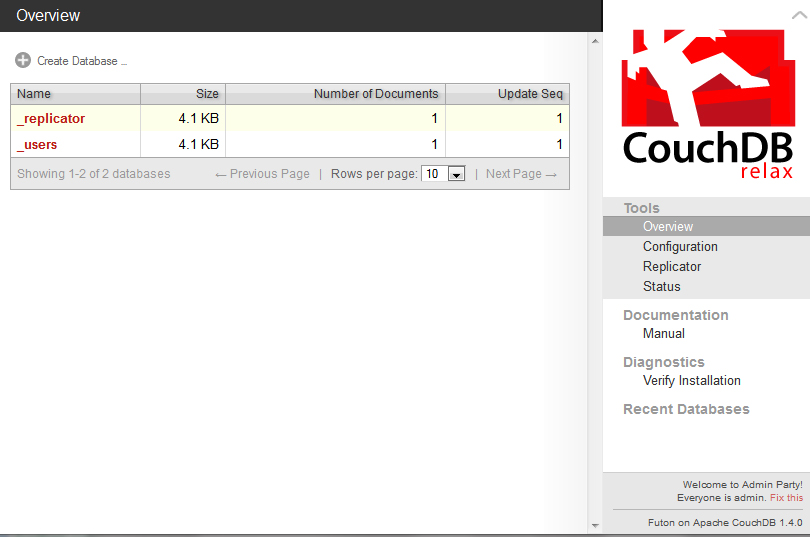

Underneath the Overview, you can see the a list of all the existing databases, how big they are in kilobytes, how many documents they hold, and how many times they've been updated. On the right side, there are links to the main page (which we are on), the configuration page, the replicator, and a status page.
Below these, the user can see the documentation type and any diagnostics that need to be run. In this screenshot, you will notice that the installation of CouchDB needs to be verified. Upon clicking on "Verify Installation", Futon will check your installation and make sure there are no errors in it. Doing this will also create two test databases (test_suite_db and test_suite_db2), however, we will be leaving those alone.

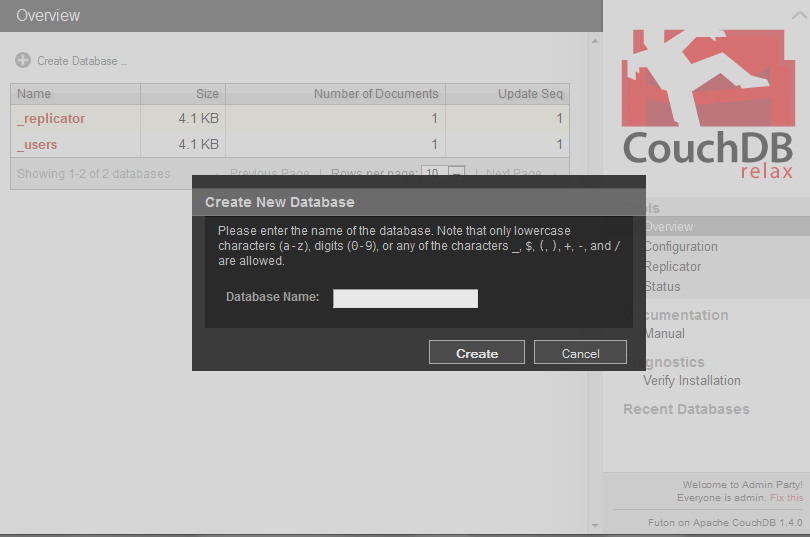

A new database can be created by clicking on the Create Database icon above the list of databases. The user will then be presented with a small, black popup window in which they will enter the name of the database they wish to create and then click Create.

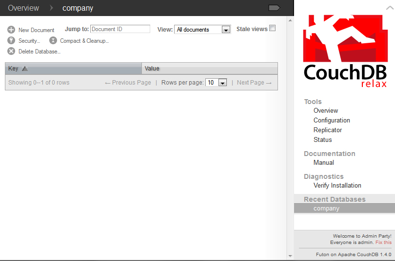

For this example, we will make a database called "company". In this database, we will explore the middle name dilemma that was explained earlier in this reading. To create a new document, click the button in the top left corner with the words "New Document" next to it.

Once a new document is created, CouchDB will assign it an ID with the _id field, which you can change if you choose to do so. However, the document ID must be a string, and it can not be changed once the document has been saved. In these examples, I made the ID of all of the documents identical to the last names of the employees.

To add more fields, click the button with a plus sign in the middle with "Add Field" next to it. 

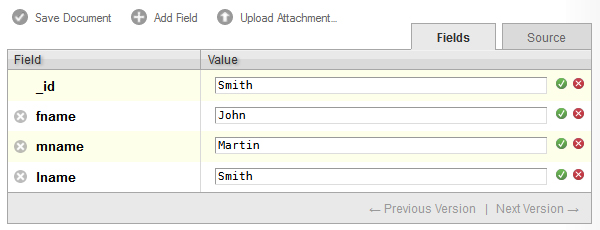

When you create a new field, you will be given a chance to type a name and a value in. You can not assign the same name to two fields in one document. In the figure above, I created three fields, fname, mname, and lname, to represent the first name, middle name, and last name of one employee. First, I started with John Martin Smith.

When you are done editing the fields, click the green circular button with a check mark to indicate you are finished for now. You can edit the text again by clicking on it. To remove a field, click on the gray and white X button on the left side of the field's name.

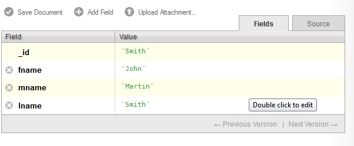
   
As you have undoubtedly noticed, CouchDB has made entering data with Futon very easy. Since the data structure is not yet defined, you do not need to set a value as being of any particular type. 

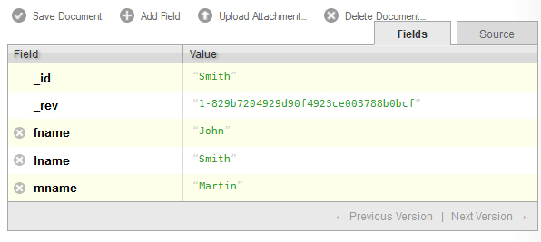

Once you are done editing all of your fields, you may save the document by clicking Save Document. Once a document is saved, Futon adds a revision field, _rev, after the _id field, as can be seen above. You may notice that CouchDB sorts the fields alphabetically once the document is saved. The _rev field is used for replication, which will be explained in more detail later.

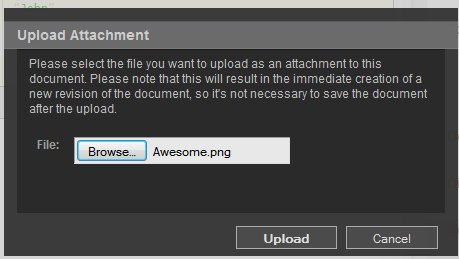
   
Attachments may be added to documents in Futon by clicking the Upload Attachment button. Upon clicking it, a black box like the one above will appear, asking you to look for a file to attach. I decided to attach a small .png file titled 'Awesome'. 

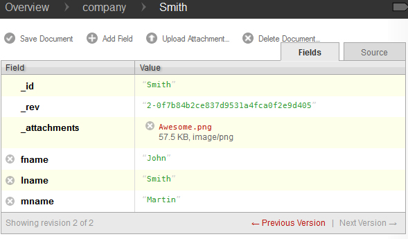

After clicking Upload, the attachment will appear in the _attachments field, as can be seen above. Now, save the document and click Source to see the JSON source for your document.

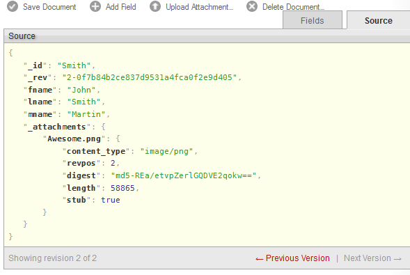
   
Should you ever want to modify the JSON directly, you can do so by double clicking on the text, as the white bubble indicates. Before continuing on, I will add documents for "Catherine Mary Louise Jones", who has two middle names, and "Jim Clark", who has no middle name.

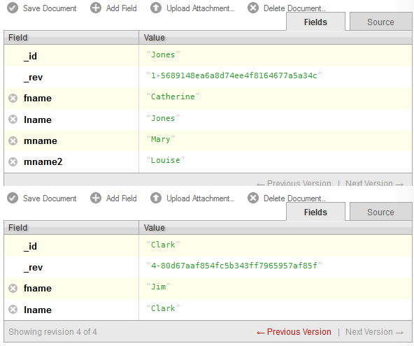

As you see here, Catherine Mary Louise Jones has the mname2 field to desginate the order of her two middle names. Jim Clark has no middle name, so that field is not even present in his document. 

Replicaton and the Replicator
=============================================

CouchDB's replicator allows for the database to make copies of itself. Unlike MongoDB's replication functionality, which only allows master servers to replicate to slave servers, CouchDB's replication allows for all servers to make copies to each other. This kind of master-master replication is possible because of the way CouchDB stores revision data.
In this way, all replication commands are essentially the same as passing several update commands to a new database.

Problems can arise, however, in scenarios where two users/servers make conflicting updates. Let's say two users (who we will unimaginatively refer to as A and B), pull _rev "1-dfdfd". User A makes a change and commits _rev "2-aaaa", only for User B to commit their own revision, which is in conflict with User A's. Since User B is updating to a _rev that is no longer the current _rev, their changes are rejected. 
Depending on the application, it is reasonable to either apply User B's revision to User A's, or to give User B the chance to edit the document again to see the changes that User A had made before.

Futon has a replicator feature, which can be seen below. Here, we are making a copy of the earlier *company* collection and replicating it to *corporation*.

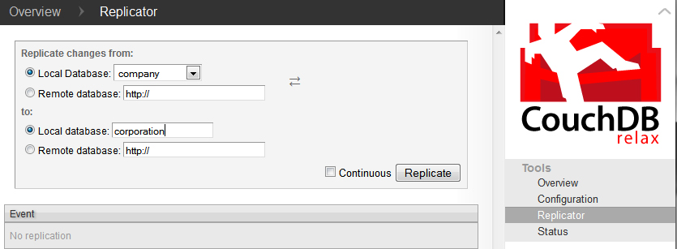

Querying CouchDB with Java
----------------------------

One of the more useful aspects of CouchDB is Apache's choice of using JSON as the query language.
Given that JSON is a fairly common format, a Java library will be required in order to make the most out of CouchDB. For the following examples, I chose to use **Json-lib**, which can be obtained either from the example projects I bundled with the reading, or on Sourceforge.
Another Java library will be required in order to here are many different Java libraries that can be used to interface with CouchDB. There are many libraries that can communicate with CouchDB, but for these examples, I chose **CouchDBJ4**. There are other Java libraries such as **Ektorp** that can also interface with CouchDB, but they are not covered here.
Both JSON-Lib and CouchDB4J have their own list of dependencies that are needed for both to run. Below is a list of all of the libraries that I used for the sample code;

* **JSON-Lib 2.4**
* **CouchDB4J**
* **EZMorph 1.0.3**
* **Apache HTTPCore 4.3.1**

As well as the following libraries from the **Apache Commons**;

* **Collections 3.2.1**
* **BeanUtils Core and Collections 1.8.3**
* **Lang 2.6**, some changes were made to Apache Commons Lang after 2.6 that do not cooperate with CouchDB4J.
* **Logging 1.1.3**
* **Codec 1.6**
* **Collections 3.2.1**

CouchDB4J
====================================

**CouchDB4J** is an open-source Java library used to interact with CouchDB. Like many things involving CouchDB, it is very simple to operate and use. 

Sessions and Databases
++++++++++++++++++++++++++++++++

In order to connect to CouchDB, you must create a Session object, which can be instantiated by one of three ways, depending on how the database itself is configured.

.. code-block:: java
   :emphasize-lines: 2,4,6
   
   //Six arguments.
   Session s = new Session(String host, int port, String user, String pass, boolean usesAuth, boolean secure);
   //Four arguments.
   Session s = new Session(String host, int port, String user, String pass);
   //Two arguments. If working off localhost, this should be enough.
   Session s = new Session(String host, int port);

As can be seen, the Session object takes a maximum of six arguments; one for the host URL, port number, username, password, and two booleans for if the session will require authentication and if the connection is an SSL connection.

.. warning:: 
	CouchDB does not support SSL connections natively, if you plan on using a SSL connection, you will need a proxy.

Once you have created your Session object, you need a Database to interact with. To interact with the *company* database that was created earlier in this reading, you would call the *getDatabase()* method in the Session object to retrieve the database by name. In the following example, I am connecting to localhost with the default port number.

.. warning:: 
	If you call a database that does not exist with Session.getDatabase(), you will receive an error message, but your program will not crash unless you perform an operation. So, if Database db = s.getDatabase("company"); does not exist, an error will be printed, but the program will continue and give Database db a null value.

.. code-block:: java
   :emphasize-lines: 7,8
   
   //Import statements.
   import com.fourspaces.couchdb.Session;
   import com.fourspaces.couchdb.Database;
   
   ... //Some code here.
   
   Session s = new Session("localhost",5984);
   Database db = s.getDatabase("company");

If, however, we decided to create a new database in Java, the last line would call a different method in the Session object. Instead of calling *getDatabase()*, we would call *createDatabase()* and insert the database name we wish to create in there, as can be seen below.

.. warning:: 
	If you create a database that already exists, you will receive an error message and Database db will be assigned a null value to prevent you from writing to an existing database that you were not aware of.

.. code-block:: java
   :emphasize-lines: 8
   
   //Import statements.
   import com.fourspaces.couchdb.Session;
   import com.fourspaces.couchdb.Database;
   
   ... //Some code here.
   
   Session s = new Session("localhost",5984);
   Database db = s.createDatabase("newDB");
   
Now, let's check Futon to see the new database that has been created by this code.

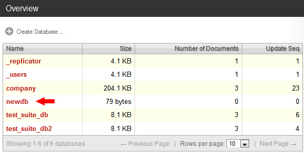

Now that we know how to create and access a Database, let's perform basic CRUD (Create, Read, Update, Delete) operations on it. The most basic of those operations is reading a document, so we will start with that. Since the *newDB* database has no contents as of this moment, we will do all of these operations on the *company* database created earlier. 

In CouchDB4J, there is a Document object that represents a document in CouchDB. Document objects can be retrieved from the database by their unique ID as can be seen below, where I search the database for a document with the ID "Smith".

.. code-block:: java
   :emphasize-lines: 9-14
   
   //Import statements.
   import com.fourspaces.couchdb.Session;
   import com.fourspaces.couchdb.Database;
   
   ... //Some code here.
   
   Session s = new Session("localhost",5984);
   Database db = s.getDatabase("company");
	try {
	Document doc = db.getDocument("Smith");
	} 
	catch (IOException e) {
	e.printStackTrace();
	}
		
   
Document objects can be pulled from the database as you saw above. To prevent any possible IOException, it is advised to surround all Document calls with a try/catch clause as highlighted in the above example. Document objects are essentially wrappers for a JSONObject, and can use all of its functionalities.

Reading Documents
++++++++++++++++++++++++++++

Earlier in this reading, a dilemma was raised about how to properly render a person's full name, including middle names, without encountering problems and without creating fields that might be left as null and thus wasting space on the database. We will now demonstrate this with a small program that queries the *company* database and pulls out the document with the ID *Smith*. Once it has the document, it will check for the following fields; *fname*, *mname*, *mname2* and *lname* and, if they exist, print them. If the field does not exist, it will be ignored.

Checking for the String value can be accomplished with Document.getString(String *fieldname*), however, this is not advised, as if the field does not exist, it will return null. Largely thanks to JSONObject, you can use Document.optString(String *fieldname*, String *defaultValue*), which will check the JSONObject to see if the field name exists. If it has content, it will return it as a String, otherwise it will return the default value that you passed to it. For our use here, this is exceptionally useful since we no longer have to concern ourselves whether or not the field has content. It also demonstrates that the data structure in CouchDB is only created when the data is needed, since we are assigning the default value of fields at run-time instead of setting the default field in advance.

Simply calling all of the fields and extracting their data is not enough, however, as the Strings we obtain need to be formatted properly. Thus, they are passed to a static factory method that checks if the String has at least 1 character in it, and then returns it with a space added to the end of it.

.. code-block:: java
   :emphasize-lines: 20-24, 26-27, 39-46
	
	import java.io.IOException;
	import com.fourspaces.couchdb.Database;
	import com.fourspaces.couchdb.Document;
	import com.fourspaces.couchdb.Session;

	public class Example01_ReadandPrintOneName {

		public static void main(String args[]) {

			// Create session, select database.
			Session s = new Session("localhost", 5984);
			Database db = s.getDatabase("company");

			try {
				// Get the document ID
				Document doc = db.getDocument("Smith");

				// Use optString instead of getString so that in case the field
				// doesn't exist, you can return a default value.
				String fname = doc.optString("fname", "");
				String mname = doc.optString("mname", "");
				String mname2 = doc.optString("mname2", "");
				String lname = doc.optString("lname", "");

				// Print the string.
				System.out.print(addSpacing(fname) + addSpacing(mname)
						+ addSpacing(mname2) + addSpacing(lname));

			} catch (IOException e) {
				e.printStackTrace();
			}

		}

		// Used for quick formatting if the String has at least 1 character in it,
		// it adds a space to the end of it. Used so "Jim Clark" is not rendered as
		// "Jim   Clark".
		
		public static String addSpacing(String str) {

			if (str.length() > 0) {
				return str + " ";
			} else
				return str;

		}

	}
	
Output:

.. code-block:: text

	John Martin Smith
	

To call all of the documents in the database, you will need to use a ViewResults object. A ViewResults object is an extension of the Document object, but used to obtain information about the results of a query. 
When using ViewResults, remember that you will not get each document, and that you will have to iterate through the ViewResults to get each of the Documents in your query with a for loop.

.. code-block:: java
   :emphasize-lines: 15-16, 36

	import java.io.IOException;
	import com.fourspaces.couchdb.Database;
	import com.fourspaces.couchdb.Document;
	import com.fourspaces.couchdb.Session;
	import com.fourspaces.couchdb.ViewResults;

	public class Example02_ReadandPrintAllNames {

		public static void main(String args[]) {

			// Create session, select database.
			Session s = new Session("localhost", 5984);
			Database db = s.getDatabase("company");

			ViewResults viewRes = db.getAllDocuments(); 
			for (Document d: viewRes.getResults()) {
				
				try {
					Document doc = db.getDocument(d.getId());
					String fname = doc.optString("fname", "");
					String mname = doc.optString("mname", "");
					String mname2 = doc.optString("mname2", "");
					String lname = doc.optString("lname", "");
					
					System.out.print(
							addSpacing(fname) +  
							addSpacing(mname) +  
							addSpacing(mname2) +  
							addSpacing(lname) +  
							"\n");
					
				} catch (IOException e) {
					e.printStackTrace();
				}
				
			}

		}

		// Used for quick formatting if the String has at least 1 character in it,
		// it adds a space to the end of it. Used so "Jim Clark" is not rendered as
		// "Jim   Clark".
		
		public static String addSpacing(String str) {

			if (str.length() > 0) {
				return str + " ";
			} else
				return str;

		}

	}

Output: 

.. code-block:: text

	Nov 10, 2013 8:18:56 PM com.fourspaces.couchdb.ViewResults getResults
	INFO: {"id":"Clark","key":"Clark","value":{"rev":"4-80d67aaf854fc5b343ff7965957af85f"}}
	Nov 10, 2013 8:18:56 PM com.fourspaces.couchdb.ViewResults getResults
	INFO: {"id":"Jones","key":"Jones","value":{"rev":"1-5689148ea6a8d74ee4f8164677a5a34c"}}
	Nov 10, 2013 8:18:56 PM com.fourspaces.couchdb.ViewResults getResults
	INFO: {"id":"Smith","key":"Smith","value":{"rev":"2-0f7b84b2ce837d9531a4fca0f2e9d405"}}
	Jim Clark 
	Catherine Mary Louise Jones 
	John Martin Smith 

As you can see in the example shown above, the highlighted lines show what changes will need to be made to query all documents in the database. In the output, you will notice that the for loop condition *Document d: viewRes.getResults()* will cause all of the documents to appear in the output. 

However, selecting all of the documents in the database is usually not ideal -- perhaps we only wish to select one or two documents. 
In that case, we need an *ad hoc* ("for this" in Latin) view of the database. Fortunately, accomplishing this feat is fairly simple. Say we only want to return documents in the *company* database where the field *fname* equals Jim. 
To do this, we simply call *Database.adhoc(String query)*, which returns a ViewResult of the documents that satisfy the query. Remember that even though the query is written in as a String, it is still a JavaScript function written as a String. An example can be seen below, with the changes and query highlighted.

.. code-block:: java
  :emphasize-lines: 18

	/** * @author Cooper Wickum */

	import java.io.IOException;
	import com.fourspaces.couchdb.Database;
	import com.fourspaces.couchdb.Document;
	import com.fourspaces.couchdb.Session;
	import com.fourspaces.couchdb.ViewResults;

	public class Example03_ReadandPrintOneSpecificName {

		public static void main(String args[]) {

			// Create session, select database.
			Session s = new Session("localhost", 5984);
			Database db = s.getDatabase("company");

			// Select all documents with the field fname with Jim as the contents.
			ViewResults viewRes = db.adhoc("function (doc) { if (doc.fname=='Jim') { emit(null, doc); }}");

			for (Document d : viewRes.getResults()) {

				try {
					Document doc = db.getDocument(d.getId());
					String fname = doc.optString("fname", "");
					String mname = doc.optString("mname", "");
					String mname2 = doc.optString("mname2", "");
					String lname = doc.optString("lname", "");

					System.out.print(addSpacing(fname) + addSpacing(mname)
							+ addSpacing(mname2) + addSpacing(lname) + "\n");

				} catch (IOException e) {
					e.printStackTrace();
				}

			}

		}

		// Used for quick formatting if the String has at least 1 character in it,
		// it adds a space to the end of it. Used so "Jim Clark" is not rendered as
		// "Jim   Clark".

		public static String addSpacing(String str) {

			if (str.length() > 0) {
				return str + " ";
			} else
				return str;

		}

	}

Output: 

.. code-block:: text

	Nov 11, 2013 4:20:08 PM com.fourspaces.couchdb.ViewResults getResults
	INFO: {"id":"Clark","key":null,"value":{"_id":"Clark","_rev":"4-80d67aaf854fc5b343ff7965957af85f","fname":"Jim","lname":"Clark","_deleted_conflicts":["2-e28f11da32baf6cb5b1213f1f97a63c9"]}}
	Jim Clark 

Creating Documents
++++++++++++++++++++++++++++

Creating documents in CouchDB using Java is not a very difficult task. To create a new document in the CouchDB database, first create a new Document object. When creating the new Document object, you can either leave no arguments, or use an existing JSONObject as the argument. Since a Document object contains a JSONObject, this is viable. In the following example, however, we use the no argument constructor.

Then you can set each of your Document's fields by using *Document.put(Object arg0, Object arg1)*, where arg0 is the name of the field, and arg1 is the contents of the field. 
This is not advisable for designating the document's ID, as there is a separate method, *Document.setId(String id)*, that is intended for designating the ID of a document. Once you are done filling in all of the required fields, you must call *Database.saveDocument(doc)*, where *doc* is the Document object you just created.

Below is a short example that creates a document, inserts two fields, and then saves it. The lines that show the document getting created are highlighted.

.. code-block:: java
  :emphasize-lines: 18-22
  
	/** * @author Cooper Wickum */

	import java.io.IOException;
	import com.fourspaces.couchdb.Database;
	import com.fourspaces.couchdb.Document;
	import com.fourspaces.couchdb.Session;

	public class Example04_CreateDocument {

		public static void main(String args[]) {

			// Create session, select database.
			Session s = new Session("localhost", 5984);
			Database db = s.getDatabase("company");

			// Create the new document, assign fields.
			try {
				Document doc = new Document();
				doc.setId("Schumi");
				doc.put("fname", "Michael");
				doc.put("lname", "Schumacher");
				db.saveDocument(doc);

			} catch (IOException e) {
				e.printStackTrace();
			}

		}

	}

Here is the document as it appears in Futon.

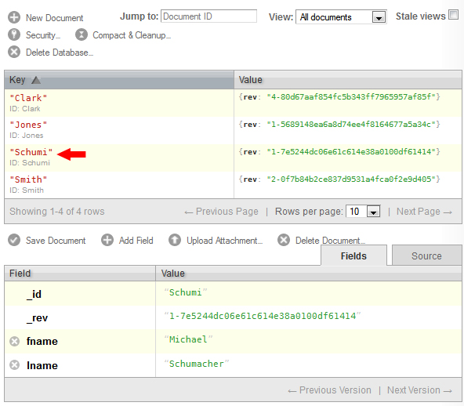

Updating Documents
++++++++++++++++++++++++++++

The same methods we have used to read and create documents can be used to update a document. Let's update the document we just created and change the *fname* field from Michael to Ralf. In addition, we will add the *mname* field and assign it the value of Michael.

To edit a field in a document, first we must call the document that we wish to change. In this instance, I chose to call by ID since the ID is known. Once we have the document, we use *Document.put(arg0, arg1)* to edit a field. To change *fname* from Michael to Ralf, we would use *Document.put("fname", "Ralf")*. 

.. warning::
	The *put(arg0, arg1)* method does not care if there is information already in a field, it will overwrite it if that field exists, and if the field doesn't exist, it will create a new field. 

Below is an example of what was described above, and a screenshot of the output in Futon.

.. code-block:: java
  :emphasize-lines: 18-21
  
	/** * @author Cooper Wickum */

	import java.io.IOException;
	import com.fourspaces.couchdb.Database;
	import com.fourspaces.couchdb.Document;
	import com.fourspaces.couchdb.Session;

	public class Example05_ChangeDocument {

		public static void main(String args[]) {

			// Create session, select database.
			Session s = new Session("localhost", 5984);
			Database db = s.getDatabase("company");

			// Call the document we want to change, edit a field, save.
			try {
				Document doc = db.getDocument("Schumi");
				doc.put("fname", "Ralf");
				doc.put("mname", "Michael");
				db.saveDocument(doc);

			} catch (IOException e) {
				e.printStackTrace();
			}

		}

	}

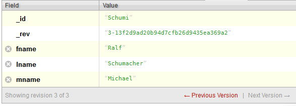

One functionality that has not been demonstrated yet is the ability to delete fields. So let's take the above example and remove the *mname* field entirely. To remove a field, call *Document.remove(String arg0)*, where arg0 is the name of the field you wish to remove. 

.. code-block:: java
  :emphasize-lines: 18-20

	/** * @author Cooper Wickum */

	import java.io.IOException;
	import com.fourspaces.couchdb.Database;
	import com.fourspaces.couchdb.Document;
	import com.fourspaces.couchdb.Session;

	public class Example06_DeleteField {

		public static void main(String args[]) {

			// Create session, select database.
			Session s = new Session("localhost", 5984);
			Database db = s.getDatabase("company");

			// Call the document we want to change, remove a field by name, save.
			try {
				Document doc = db.getDocument("Schumi");
				doc.remove("mname");
				db.saveDocument(doc);

			} catch (IOException e) {
				e.printStackTrace();
			}

		}

	}
	
	.. figure::  images/couch/futon_14.jpg
   :align:   center
   :alt: The document we just changed.

Deleting Documents
++++++++++++++++++++++++++++

.. code-block:: java
  :emphasize-lines: 18-20

	/** * @author Cooper Wickum */

	import java.io.IOException;
	import com.fourspaces.couchdb.Database;
	import com.fourspaces.couchdb.Document;
	import com.fourspaces.couchdb.Session;

	public class Example07_DeleteDocument {

		public static void main(String args[]) {

			// Create session, select database.
			Session s = new Session("localhost", 5984);
			Database db = s.getDatabase("company");

			// Call the document we want to delete, and then delete it.
			try {
				Document doc = db.getDocument("Smith");
				db.deleteDocument(doc);

			} catch (IOException e) {
				e.printStackTrace();
			}

		}

	}

.. figure::  images/couch/futon_15.jpg
   :align:   center
   :alt: The document with the ID Smith was deleted.
