.. Cloud Databases documentation master file, created by
   sphinx-quickstart on Tue Oct 08 18:07:51 2013.
   You can adapt this file completely to your liking, but it should at least
   contain the root `toctree` directive.

MongoDB
-------------------------

   
**MongoDB** is an open-source document-based database that was written in C++. It is the most widely used NoSQL database, being used by companies such as MetLife, MTV, MyEdu, SAP, Sourceforge, Stripe, Under Armour, and many, many others (in case you wish to see the full list compiled by MongoDB themselves, it is viewable on MongoDB's own website: http://www.mongodb.org/about/production-deployments/).

Features of MongoDB
-------------------------

MongoDB stores all of its documents in BSON (Binary JSON). The problem with BSON documents is that they are larger than JSON documents. Recent versions of MongoDB allow for documents as large as 16MB, however, if you are using documents that large, it is likely that your documents are improperly designed. If, however, you need to use documents that large, GridFS is a much better alternative.
Generally speaking, it might be best to avoid creating large documents, especially if they are updated often, as those operations may take a significant amount of time.

Unlike CouchDB, which provides eventual consistency, MongoDB provides enforced consistency.

Replication and Replica Sets
=====================================

In order to ensure that data is always available to users, MongoDB provides a form of replication in the form of replica sets.
Replication protects a database by having multiple copies of the data on multiple servers.
By making additional copies of the data, one or more copies can be designated for disaster recovery and backups.
In this way, it is possible for MongoDB to recover from either service or hardware failures.
Replication can also be used to increase the capacity of read operations, since read and write operations can be performed on completely different servers.

MongoDB introduces the concept of a **replica set**, which is a group of up to 12 *mongod* instances that hold the same data set. 
The primary *mongod* instance is used for all write operations. Each replica set can only have one primary *mongod* instance, and because of this, replica sets provide for strict consistency. The other members of replica sets are either **secondaries**, which use operations given to them by the primary so that their data sets are identical, and **arbiters**, whose purpose will be explained later in this reading.

For replication to function, the primary records all of the changes made to its data sets in it's **oplog**. An oplog (short for operations log) is a record of all operations that modify the data. Once these operations are applied to the primary, they are passed to the secondary members of the replica set. A diagram can be seen below.

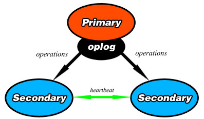

Once an operation is passed to the secondaries, they each apply it and record it in their own oplogs. 
To ensure replication, each member of the replica set sends a heartbeat (essentially a ping) to every other member in the replica set evert two seconds.

Arbiters
++++++++++++++++++++++++++++++++

An **arbiter** is an element in a replica set which does not contain a dataset. It's only purpose is to vote in elections, they cannot become the primary. As a result, the arbiter's best use is as a tiebreaker when there are an even number of members in a replica set. Since the arbiters do not hold a copy of the data set, they do not require any additional hardware to operate, and operations from the primary's *oplog* are not passed to them. 

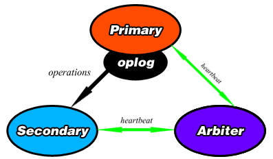

A diagram showing a primary, secondary, and an arbiter in a replica set. 

Elections
++++++++++++++++++++++++++++++++

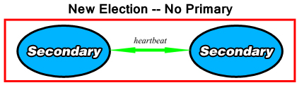

When a replica set is created, the primary steps down, or when the primary becomes unavailable for more than 10 seconds, the remaining elements of the replica set will hold an election to determine which of the secondaries will assume the role of the primary.
Elections take some time to complete, and as a result, MongoDB attempts to avoid them unless there are no other options.

Similarly to the real world, each member in the replica set has certain factors that set them apart from other candidates. Some of those factors are listed below.

* If a heartbeat from one member does not return after ten seconds, the others will consider that the member is inaccessible.
* Each member in the replica set has a priority value attached to it. This value can be from between 0 and 100 (including decimals), and its only purpose is for eligibility to become the primary during an election. The higher the *priority* value, the more likely the element will become primary. A *priority* of 0 renders it impossible for a secondary to become a primary.
* The timestamp of the last operation applied from the *oplog*, called the *optime*, is also a factor. The more recent the *optime* is, the greater its chances are at becoming primary.
* The ability for a replica set to be able to connect to a majority of the other members of the set. 

.. warning:: 
	If no partition of the network contains a majority of the replica set, the replica set will not hold an election for a new primary and will become read-only. One way to avoid this situation is for a majority of the replica set to exist in one location, and the minority of instances elsewhere. 

.. figure::  images/mongo/replication_4.jpg
   :align:   center
   :alt: Election results.

Automatic Sharding
===========================

Among MongoDB's core functionalities is that it utilizes horizontally scaling, also known as **sharding**.
Sharding is the practice of dividing the data set and distributing each piece, or **shard** of the data set to different servers as an independent database. The shards form one single database logically, even though they may be in different locations. 
As the number of shards increases, the operations that each shard has to handle decreases, as does the amount of data each shard possesses. 

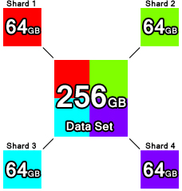
   
The above diagram shows the basic idea of sharding. Each of the four colored boxes in the corners is part of the multicolored box in the center (representing the complete data set), but they all exist separately in different locations. 

.. warning:: 
	You cannot perform sharding on a collection larger than 256GB -- this is a limitation that MongoDB will eventually remove. Earlier versions of MongoDB had a much smaller limit.

Sharded Clusters
+++++++++++++++++++++++++++

MongoDB implements sharding by using **sharded clusters**, a form of deployment that consists of at least one *mongos* routing process, at least one shard (replica set), and three configuration processes.

The shards store the data in a sharded cluster, with each shard being a replica set. The *mongos* processes are query routers, which interface with the client applications. They direct the operations to the required shard(s), and return results to the clients. The request load from the clients can be divided across multiple query routers.
The three config servers contain the metadata of the sharded cluster, and is used by the query router to match operations to the appropriate shards. **There are always three config servers.**

Installing MongoDB (Windows)
----------------------------------

.. warning:: 
	Versions of MongoDB after version 2.2 do not support Windows XP. 
	
.. warning:: 
	Windows Server 2008 R2 and Windows 7 have an issue involving memory-mapped files. Microsoft does provide a hotfix for this.

There are three available builds of MongoDB that can be downloaded from the MongoDB downloads page (http://www.mongodb.org/downloads);

* MongoDB 32-bit.
* MongoDB 64-bit.
* MongoDB for Windows Server 2008 R2. It only runs on Windows Server 2008 R2, Windows 7 64-bit, and any newer version of Windows.

Once you have downloaded the correct version for your system, extract the archive somewhere where it will be easy to remember where you placed it.
Since we will be working in the command prompt for now, the examples provided here will assume that the user placed MongoDB folder in **C:\\** and renamed the folder to just **MongoDB**.

MongoDB is self-contained, meaning that it does not depend on any other parts of the system. 

Before running MongoDB, be aware that MongoDB requires a directory to store your data in. The default location is **C:\\data\\db**. Alternatively, you can use another directory path for storing data, but you must declare this with the *--dbpath* flag after running *mongod.exe*.

To start MongoDB, type in the path of *mongod.exe* into the Command Prompt, so for our example; **C:\\MongoDB\\bin\\mongod.exe**.

.. warning:: 
	Since MongoDB does not support encryption by default, MongoDB is supposed to be run in a trusted environment -- in other words, home or work networks. By default, MongoDB does **NOT** use any kind of authentication.

Connecting to MongoDB
==============================

In order to connect to your local MongoDB, open another command prompt and type in **C:\\MongoDB\\bin\\mongo.exe company**. This will connect to the *mongod.exe* process that is already running on port 27017 on the database named *company*. If you do not specify a database name at the end of this command, you will connect to the database named *test*.

CRUD in MongoDB -- Command Prompt
=================================================

Creating Documents
+++++++++++++++++++++++++

In order to perform any further operations in MongoDB with the command prompt, we must first add a database. Fortunately, both can be done at the same time. We will emulate the naming dilemma seen in the CouchDB examples, but we will also assign everyone an age, which will be intended to be an integer value. 

Inside each database are buckets called **collections**, which will hold all of our data. We will place everyone in a collection called *staff*. Since we can create our first document at the same time we create the collection, let's enter the following into *mongo.exe*:

.. code-block:: text

	db.staff.insert( { fname: "Mike", lname: "Conway", age: 29 } )
		
Similarly to CouchDB, you have to specify the document's ID when you create it. However, there are two other ways to add a document into MongoDB. The second method uses the *update()* method with the *upsert* attached. The *upsert* flag allows for the document to be created if it does not already exist. This is shown below;

.. code-block:: text

	db.staff.update( { _id: 477 },{ $set: { fname: "Kevin", mname: "James", lname: "Conway", age: 34} },{ upsert : true } )

The above code looks for a document with the ID of 477 as can be seen in the first set of {} brackets. The second set chooses what values will be added to the document, and if *upsert* is true, it will create the document if it does not match an existing document. As you may have noticed, unlike in CouchDB, MongoDB does accept integer values for its _id tag.

The third method to create a document in the command prompt is to use the save() method. To use this method to make a new document, you have to ensure that either the _id you specified does not exist, or that you do not enter the _id field at all. For our demo, we know that the only _id that should exist so far is 477, with the previous document, so we will assign this document the _id of 478.

.. code-block:: text

	db.staff.save( { _id: 478, fname: "Mike", mname: "William", lname: "Dawes", age: 18 } )

Reading Documents
+++++++++++++++++++++++++

Now that we have added three documents, let's display all of the documents that we have added to the *staff* collection. To view every document in a collection, type the following command into your *mongo.exe* command prompt.

.. code-block:: text

	db.staff(find)
	
Output:

.. figure::  images/mongo/cmd_1.jpg
   :align:   center
   :alt: All three documents we have created and all of their contents.

As you can see, the first document (the one we did not enter an _id for) has a long ObjectID, and using the update command will insert the fields in the document in alphabetical order. Both the *insert* and *save* methods entered them in the same order they were entered when they were created. Variance among the order of fields may be somewhat confusing, so it is best to avoid doing that.

First, let's do a basic selection by selecting all documents in the *staff* collection where the age field is equal to 18. When we display these documents, let's show _id, mname, and age. We do not need to tell Mongo to return the _id, so we only specify mname and age.

.. code-block:: text
	
	db.staff.find( { age: 18 }, { mname: 1, age: 1 } )
	
Output:

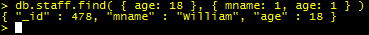

.. note::

	If we don't want to return the _id, we would add **_id: 0** to the second set of brackets in the query.

Now lets pull all documents in which the age field is greater than 18. Notice that this is only a slight modification of the previous query.

.. code-block:: text
	
	db.staff.find( { age: { $gt: 18 } }, { mname: 1, age: 1 } )
	
Output:

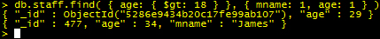
   
In the query above, you may notice, in the first set of brackets, there is a query operator *$gt*, which stands for 'greater than'. Many, if not all of the same query operators that exist in SQL operators exist in MongoDB, the basic comparison and logical operators are listed below;

.. note::

	* $gt - Greater than
	* $gte - Greater than or equal to
	* $lt - Less than
	* $lte - Less than or equal to
	* $ne - Not equal to
	* $in - Returns documents that contain the specified values in an array. To return all documents where the field *type* contains either *bird* or *cat*, use *find( {type: {$in: ['bird', 'cat'] } } )*
	* $nin - Returnss documents that to NOT contain the specified values in an array.
	* $and, $or, $not, $nor - Logical operators.
	* $exists - Returns documents that contain the specified value(s).
	* $type - Returns documents that have a field of the specified type.
	* $where - Essentially the same as a WHERE clause in MySQL, except in this case, $where is a JavaScript function.
	
Sometimes, it may make it easier if query results were sorted by a certain numerical value. In cases like these, we would append *.sort()* to the end of our query. When using *sort()*, you have to specify what value you want to use as your sort key and whether you want to sort ascending or descending. For asceding order, use 1, and for descending, use -1.

For this next example, let's sort every document by age in descending order, returning only the _id and age.

.. code-block:: text
	
	db.staff.find( { }, { age: 1 } ).sort({ age: -1 })
	
Output:

.. figure::  images/mongo/cmd_4.jpg
   :align:   center
   :alt: A list of all documents by age in descending order.

Assume we wished to limit ourselves to only showing the first two documents in the previous query's results, showing the oldest two staff members. We would tack *limit(x)* to the end of the query, with x representing the number of responses we would obtain.

.. code-block:: text
	
	db.staff.find( { }, { age: 1 } ).sort({ age: -1 }).limit(2)
	
Output:

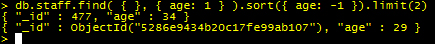

Updating Documents
+++++++++++++++++++++++++

Earlier, we used the commands *update()* and *save()* to create a document. Both of these same commands can also be used for updating an existing document.

For starters, let's select the document with the _id of 477 and add 4 years to their age. Instead of having to set their age to one static value, we can use $inc (short for increment) to accomplish this.

.. code-block:: text
	
	db.staff.update( { _id: 477 }, { $inc: { age: 4 } } )

Now let's check the results:

Output:

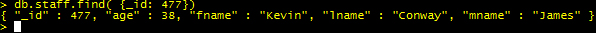

It is possible to update more than one row at a time, so for this next example, we will select every document with the *lname* value being "Conway" and change it to "Curran". 

To modify multiple documents that satisfy the condition in the first set of brackets, we add a third set of brackets to the end containing *multi: true*, as can be seen below.

.. code-block:: text
	
	db.staff.update( { lname: "Conway" }, { $set: { lname: "Curran" } }, {multi: true} )

To check the results, I searched for all documents in the *staff* collection with *lname* equal to "Curran", and then all documents with *lname* equal to "Conway". As you can see in the figure below, "Conway" got no results, and "Curran got two."

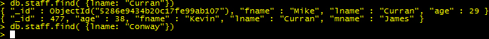
   
Using the *save()* method for updating documents requires that you know what the _id of the document is before updating it, otherwise, as explained before, it will create a new document.
Also, when using *save()*, you will replace the entire document with the content of the *save* command. It will replace everything in that document with the contents it is given.
Let's use the *save()* method to change the fields of tthe document with _id of 478.
We will change *fname* to Erin, *lname* to Marchesi, and we will set the *age* to 19. Note that the previous document had a middle name. This one will not.

.. code-block:: text
	
	db.staff.save({ _id: 478, fname: "Erin", lname: "Marchesi", age: 19 } )
	
Now let's check the results:

Output:

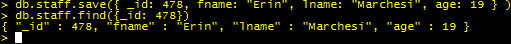

As can be seen, even though the original had a mname, the *save()* function overwrote the entire document with what was passed to it. Be careful when using it.

Deleting Documents
+++++++++++++++++++++++++

.. warning:: 
	You can not use *remove()* on a capped collection. 

Deleting documents is a very simple task in the command prompt. There is one method for deleting documents, *remove()*, that can take zero to two arguments.

.. code-block:: text
	
	db.staff.remove()

Calling *remove()* with no arguments will remove all documents in that database, and while that may seem the easiest way to clean out a collection, it does not remove indexes. It may be more efficient to call *drop()* on that particular database if your intention is to clean it out entirely, since *drop()* removes all of the indexes.

.. code-block:: text
	
	db.staff.remove( {age: 19} )
	
Calling *remove()* with one argument will remove all documents who satisfy the conditions of the query in brackets (in this case, all documents with age being equal to 19). If you are deleting a large number of documents, consider copying all of the documents you wish to save to a new collection, and then calling *drop()* on the current database.

.. code-block:: text
	
	db.staff.remove( {age: 19}, 1 )
	
Calling *remove()* with two arguments, as shown above, removes only one document from the database that satisfies the conditions in the query. Instead of placing '1' behind the comma, you can alternatively type 'true', and it will have the same effect.

MongoDB in Java
=========================

Connecting to MongoDB with Java requires only one library -- the **Mongo Java Driver**, which is available from the MongoDB website in the Java Language Center(http://docs.mongodb.org/ecosystem/drivers/java/).
The Java Language Center provides links to several third party libraries, but this demonstration uses version 2.10.1. of the official Mongo Java Driver(http://central.maven.org/maven2/org/mongodb/mongo-java-driver/2.10.1/).

Connecting
+++++++++++++++++++++++++

Connecting to only one instance of MongoDB is fairly simple in Java. To connect to only one instance of MongoDB
, create a new *MongoClient* object and enter two arguments, a String containing the host URL, and an integer for the port number. 

.. note::

	Creating a new MongoClient object with no arguments in the constructor will default to connecting to *localhost:27017*. Alternatively, if you only enter a host name, it will connect to the host using the default port (27017).

.. code-block:: java

	try {
		MongoClient mon = new MongoClient("localhost", 27017);
	} 
	catch (UnknownHostException e) {
		e.printStackTrace();
	}
	
In the above example, the host name and port number are both used to create a ServerAddress object inside the Mongo object. 
It is possible to connect to a sharded cluser with the same constructor by making the argument in the Mongo object a list of ServerAddress objects. 
An example is seen below. 

.. code-block:: java

	try {
		MongoClient mon = new MongoClient(Arrays.asList(
		new ServerAddress("localhost", 27017), 
		new ServerAddress("localhost", 27018),
		new ServerAddress("localhost", 27019)));
	} 
	catch (UnknownHostException e) {
		e.printStackTrace();
	}
	
.. note::
	Mongo is able to tell the difference between a *mongos* server and a list of replica set members.
	
.. warning:: 
	If one of the ServerAddresses cannot connect to Mongo, it will return an error message.

To access a database, you need to create a database object and point it to a database in Mongo. Do this by creating a DB object and calling *MongoClient.getDB(String X)*.

If your MongoDB has authentication, you can check authentication by calling *DB.authenticate(String username, char[] password)*, which returns a boolean value. An example of both connecting to a database (we will be connecting to the company database created earlier) and authentication is shown below;

.. code-block:: java
   :emphasize-lines: 2-3

	try {
			MongoClient mon = new MongoClient("localhost", 27017);
			DB db = mon.getDB("company");
			boolean auth = db.authenticate(username, password); //Optional
		} 
	catch (UnknownHostException e) {
		e.printStackTrace();
	}

Reading Documents
+++++++++++++++++++++++++

In order to read any documents at all, we need a way to go into the collection that contains the documents we need. To accomplish this, we 
call a new *DBCollection* object. A *DBCollection* object is the Java representation of a collection. To get a specific collection in a *DB*
object, use *DB.getCollection(String s)*, which returns a *DBCollection* of the contents of a collection sharing a name with String s. If there
is no collection sharing the same name, an empty *DBCollection* is created.

Next, create a *DBCursor* object, which is essentially an iterator for query results. The *DBCollection.find(BasicDBObject query)* method returns a *DBCursor*
of the results of a query as defined by the *BasicDBObject*. *DBCollection.find()* works the same way the *db.collection.find()* command does in the shell, as leaving no arguments will return every item in the collection. Once we have
a *DBCursor*, we can iterate through it by using a loop to retrieve each result contained in the *DBCursor*.

For this example, assume that all of the remove operations that were done in the shell have been undone.

.. code-block:: java
   :emphasize-lines: 14-21

	import java.net.UnknownHostException;
	import com.mongodb.DB;
	import com.mongodb.DBCollection;
	import com.mongodb.DBCursor;
	import com.mongodb.MongoClient;

	public class Example01_GetAllItemsFromACollection {

		public static void main(String args[]) {

			try {
				MongoClient mon = new MongoClient("localhost", 27017);
				DB db = mon.getDB("company");
				DBCollection staffColl = db.getCollection("staff");

				DBCursor cursor = staffColl.find();

				while (cursor.hasNext()) {
					System.out.println(cursor.next());
				}
				cursor.close();

			} catch (UnknownHostException e) {
				e.printStackTrace();
			}

		}
	}

Output:

.. code-block:: text

	{ "_id" : { "$oid" : "528845205e9f772541afc58a"} , "fname" : "Mike" , "lname" : "Curran" , "age" : 29.0}
	{ "_id" : 477.0 , "age" : 38.0 , "fname" : "Kevin" , "lname" : "Curran" , "mname" : "James"}
	{ "_id" : 478.0 , "fname" : "Erin" , "lname" : "Marchesi" , "age" : 19.0}
	
The first document, as was the case earlier, has its assigned ObjectID, here shown as "$oid". Note that all of the numerical values are shown as decimals here.

To make a query have some kind of condition, you will need to send a *BasicDBObject* to the *DBCollection.find(BasicDBObject query)* method. When creating a *BasicDBObject(a, b)*, we will add a condition for our query, where *a* is the name of the field or condition, and *b* is the value. 
*BasicDBObject query = new BasicDBObject("lname", "Curran");* will return all values where the *lname* field equals "Curran". If we wish to add more conditions, we use the *BasicDBObject.append(String a, Object b)* method to add more conditions to the query.
To add a conditions which use a query operator, such as returning all documents where the field *age* is a value less than 30, we use *BasicDBObject.append("age", new BasicDBObject("$lt", 30));*. Here, we add another *BasicDBObject* as the second argument, and place the conditional operator in the first argument.

The code below will return all documents with *lname* equal to "Curran" and with *age* less than 30.

.. code-block:: java
   :emphasize-lines: 18-23
	
	import java.net.UnknownHostException;

	import com.mongodb.BasicDBObject;
	import com.mongodb.DB;
	import com.mongodb.DBCollection;
	import com.mongodb.DBCursor;
	import com.mongodb.MongoClient;

	public class Example02_GetAllItemsNamedCurran {

		public static void main(String args[]) {

			try {
				MongoClient mon = new MongoClient("localhost", 27017);
				DB db = mon.getDB("company");
				DBCollection staffColl = db.getCollection("staff");

				// Create query conditions as a BasicDBObject
				BasicDBObject query = new BasicDBObject("lname", "Curran");

				// Append another condition to return all documents with age less
				// than 30.
				query.append("age", new BasicDBObject("$lt", 30));

				DBCursor cursor = staffColl.find(query);

				while (cursor.hasNext()) {
					System.out.println(cursor.next());
				}
				cursor.close();

			} catch (UnknownHostException e) {
				e.printStackTrace();
			}

		}
	}

Output:

.. code-block:: text

	{ "_id" : { "$oid" : "528845205e9f772541afc58a"} , "fname" : "Mike" , "lname" : "Curran" , "age" : 29.0}

Creating Documents
+++++++++++++++++++++++++

In the previous example, we saw how to use the *BasicDBObject* to read from a document. Using the same means, we can use it to create a new document.

.. code-block:: java
   :emphasize-lines: 18-23

	import java.net.UnknownHostException;

	import com.mongodb.BasicDBObject;
	import com.mongodb.DB;
	import com.mongodb.DBCollection;
	import com.mongodb.DBCursor;
	import com.mongodb.MongoClient;

	public class Example03_CreateNewDocument {

		public static void main(String args[]) {

			try {
				MongoClient mon = new MongoClient("localhost", 27017);
				DB db = mon.getDB("company");
				DBCollection staffColl = db.getCollection("staff");

				// Create query conditions as a BasicDBObject
				BasicDBObject query = new BasicDBObject("_id", 479)
						.append("fname", "Anakin")
						.append("lname", "Skywalker")
						.append("age", 10);

				staffColl.insert(query);

				// Read all documents when we are finished so we can check the
				// output.
				DBCursor cursor = staffColl.find();

				while (cursor.hasNext()) {
					System.out.println(cursor.next());
				}
				cursor.close();

			} catch (UnknownHostException e) {
				e.printStackTrace();
			}

		}
	}

Output:

.. code-block:: text

	{ "_id" : { "$oid" : "528845205e9f772541afc58a"} , "fname" : "Mike" , "lname" : "Curran" , "age" : 29.0}
	{ "_id" : 477.0 , "age" : 38.0 , "fname" : "Kevin" , "lname" : "Curran" , "mname" : "James"}
	{ "_id" : 478.0 , "fname" : "Erin" , "lname" : "Marchesi" , "age" : 19.0}
	{ "_id" : 479 , "fname" : "Anakin" , "lname" : "Skywalker" , "age" : 10}
	
As you can see in the highlighted lines in the code shown above, we use *BasicDBObject* in almost the same way for reading and creating. The only major difference is the presence of *DBCollection.insert(BasicDBObject query)*, which essentially mimics the *db.collection.insert()* method in the command prompt. Notice too that the numerical values that we entered are appearing as integers instead of decimals.

Updating Documents
+++++++++++++++++++++++++

The *BasicDBObject* can also be used for update queries as well. In this section, we will show how to perform a *db.collection.update()* command in Java. 
In order to run the update query, we need to create a second *BasicDBObject* in order to modify the fields that we want to update. 
We then pass this second *BasicDBObject* to the *DBCollection.update()* method, which accepts two *BasicDBObjects*, the first to specify the objects that you will be updating.
The second *BasicDBObject* will determine what fields will be updated. You can optionally add two booleans, the first to determine the *upsert* flag, and the second to determine the *multi* flag.

An example of how to use this is shown below.

.. code-block:: java
   :emphasize-lines: 18-31

	import java.net.UnknownHostException;

	import com.mongodb.BasicDBObject;
	import com.mongodb.DB;
	import com.mongodb.DBCollection;
	import com.mongodb.DBCursor;
	import com.mongodb.MongoClient;

	public class Example04_UpdateDocument {

		public static void main(String args[]) {

			try {
				MongoClient mon = new MongoClient("localhost", 27017);
				DB db = mon.getDB("company");
				DBCollection staffColl = db.getCollection("staff");

				// Pick the object to update by parameters.
				BasicDBObject findQuery = new BasicDBObject("fname", "Anakin")
						.append("lname", "Skywalker");
				
				// Query for the fields to insert into update.
				BasicDBObject updateQuery = new BasicDBObject("fname", "Darth")
				.append("lname", "Vader").append("age", 35);

				// Booleans for upsert and multi
				boolean upsert = false;
				boolean multi = false;
				
				// Run the update query.
				staffColl.update(findQuery, updateQuery, upsert, multi);
				
				// Read all documents when we are finished so we can check the
				// output.
				DBCursor cursor = staffColl.find();
				
				while (cursor.hasNext()) {
					System.out.println(cursor.next());
				}
				cursor.close();

			} catch (UnknownHostException e) {
				e.printStackTrace();
			}

		}
	}

Output: 

.. code-block:: text

	{ "_id" : { "$oid" : "528845205e9f772541afc58a"} , "fname" : "Mike" , "lname" : "Curran" , "age" : 29.0}
	{ "_id" : 477.0 , "age" : 38.0 , "fname" : "Kevin" , "lname" : "Curran" , "mname" : "James"}
	{ "_id" : 478.0 , "fname" : "Erin" , "lname" : "Marchesi" , "age" : 19.0}
	{ "_id" : 479 , "fname" : "Darth" , "lname" : "Vader" , "age" : 35}

As you may remember, there is another command that is used for updating documents in MongoDB, that being *db.collection.save()*.
The *DBCollection.save()* works in much the same way that the *db.collection.save()* did in the console. *DBCollection.save()* can take
a *BasicDBObject* and perform the save operation on the database. The below example shows it being used to both create a new document
and to modify an existing one.

.. code-block:: java
   :emphasize-lines: 18-30

	import java.net.UnknownHostException;

	import com.mongodb.BasicDBObject;
	import com.mongodb.DB;
	import com.mongodb.DBCollection;
	import com.mongodb.DBCursor;
	import com.mongodb.MongoClient;

	public class Example05_SaveDocument {

		public static void main(String args[]) {

			try {
				MongoClient mon = new MongoClient("localhost", 27017);
				DB db = mon.getDB("company");
				DBCollection staffColl = db.getCollection("staff");

				// Pick the object to update by parameters.
				BasicDBObject saveNew = new BasicDBObject("fname", "Luke")
					.append("lname", "Skywalker")
					.append("age", 20);

				// Query for the fields to insert into update.
				BasicDBObject saveUpdate = new BasicDBObject("_id", "479")
					.append("fname", "James").append("mname", "Earl")
					.append("lname", "Jones").append("age", 82);

				// Run the save queries.
				staffColl.save(saveNew);
				staffColl.save(saveUpdate);

				// Read all documents when we are finished so we can check the
				// output.
				DBCursor cursor = staffColl.find();

				while (cursor.hasNext()) {
					System.out.println(cursor.next());
				}
				cursor.close();

			} catch (UnknownHostException e) {
				e.printStackTrace();
			}

		}
	}

Output: 

.. code-block:: text

	{ "_id" : { "$oid" : "528845205e9f772541afc58a"} , "fname" : "Mike" , "lname" : "Curran" , "age" : 29.0}
	{ "_id" : 477.0 , "age" : 38.0 , "fname" : "Kevin" , "lname" : "Curran" , "mname" : "James"}
	{ "_id" : 478.0 , "fname" : "Erin" , "lname" : "Marchesi" , "age" : 19.0}
	{ "_id" : 479 , "fname" : "Darth" , "lname" : "Vader" , "age" : 35}
	{ "_id" : { "$oid" : "5289abff7cf311038788282f"} , "fname" : "Luke" , "lname" : "Skywalker" , "age" : 20}
	{ "_id" : "479" , "fname" : "James" , "mname" : "Earl" , "lname" : "Jones" , "age" : 82}

Deleting Documents
+++++++++++++++++++++++++

Removing documents from Mongo in Java is almost the exact same code as creating or updating a document. The main difference is that to remove a document, we call *DBCollection.remove()* and pass a *BasicDBObject* to it. In the following example, we will remove one document based on specific fields.

.. code-block:: java
   :emphasize-lines: 18-24

	import java.net.UnknownHostException;

	import com.mongodb.BasicDBObject;
	import com.mongodb.DB;
	import com.mongodb.DBCollection;
	import com.mongodb.DBCursor;
	import com.mongodb.MongoClient;

	public class Example06_RemoveDocument {

		public static void main(String args[]) {

			try {
				MongoClient mon = new MongoClient("localhost", 27017);
				DB db = mon.getDB("company");
				DBCollection staffColl = db.getCollection("staff");

				// Pick the object to delete by parameters.
				BasicDBObject deleteMe = new BasicDBObject("fname", "Luke")
					.append("lname", "Skywalker")
					.append("age", 20);

				// Run the remove queries.
				staffColl.remove(deleteMe);

				// Read all documents when we are finished so we can check the
				// output.
				DBCursor cursor = staffColl.find();

				while (cursor.hasNext()) {
					System.out.println(cursor.next());
				}
				cursor.close();

			} catch (UnknownHostException e) {
				e.printStackTrace();
			}

		}
	}
	
Output:

.. code-block:: text
	
	{ "_id" : { "$oid" : "528845205e9f772541afc58a"} , "fname" : "Mike" , "lname" : "Curran" , "age" : 29.0}
	{ "_id" : 477.0 , "age" : 38.0 , "fname" : "Kevin" , "lname" : "Curran" , "mname" : "James"}
	{ "_id" : 478.0 , "fname" : "Erin" , "lname" : "Marchesi" , "age" : 19.0}
	{ "_id" : 479 , "fname" : "Darth" , "lname" : "Vader" , "age" : 35}
	{ "_id" : "479" , "fname" : "James" , "mname" : "Earl" , "lname" : "Jones" , "age" : 82}

Run MongoDB Service -- Windows
======================================

.. note:: 
	
	The commands and directory listings here are identical to the ones on the MongoDB documents.

In order to run MongoDB as a service in Windows (using *mongod*), you first need to run a console with Administrator Privledges.
First, we need to specify a directory for the *mongod* logpath, which will contain diagnostics and database logs. Keep in mind that MongoDB will overwrite previous versions unless the *logappend* flag is marked true.

In addition, we also need a configuration file for the logpath, and we can create them in the console by entering;

.. code-block:: text
	
	echo logpath=C:\mongodb\log\mongo.log > C:\mongodb\mongod.cfg

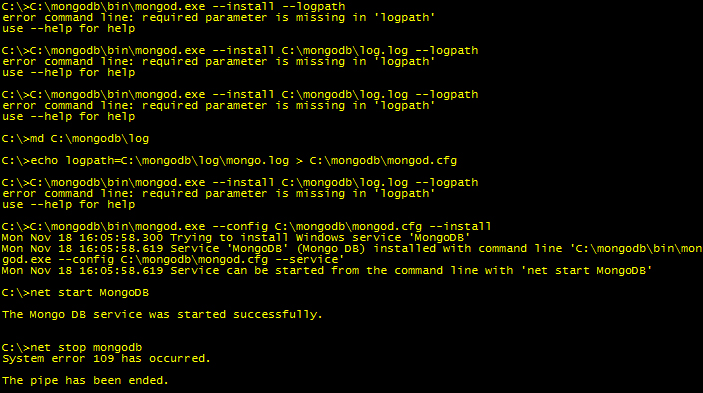

Designer Traps
-------------------------

When using the 32-bit version of MongoDB, keep in mind that the amount of data you can store is significantly limited compared to if you were using a 64-bit version of MongoDB. As a result, 32-bit versions of MongoDB are best suited for sharding, as shards are intended to hold less data for quicker writes.

MongoDB does not support joins like a relational database does, and to get the same effect as a join, multiple queries will be required. Problems with MongoDB can arise because denormalizing data may result in very large documents. Finding a balance, therefore, is essential.
