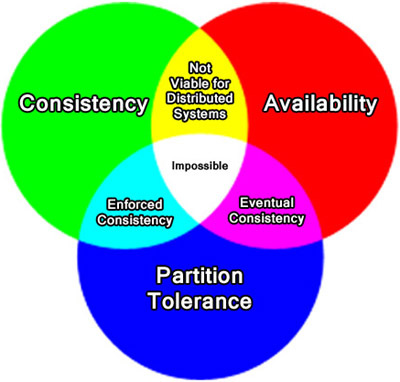

.. Cloud Databases documentation master file, created by
   sphinx-quickstart on Tue Oct 08 18:07:51 2013.
   You can adapt this file completely to your liking, but it should at least
   contain the root `toctree` directive.

NoSQL Databases
-------------------------

The term 'NoSQL database' is generally applied to any database that does not use the relational database model. While there are many different kinds of NoSQL databases, all of them were created for the same purpose; to face the challenges of modern computing, many of which are driven by large amounts of data and user traffic.
NoSQL databases generally are generally not designed to use relations in the same way a relational database does. 
 
Some NoSQL databases, such as FountainDB, stretch the boundaries of the term 'NoSQL' by allowing SQL to be used with it. This has led some to interpret 'NoSQL' as an acronym for **N**ot **O**nly **SQL**, but these cases are not very common.

The CAP Theorem
======================

The **CAP Theorem** is a name given to an ideology for designing distributed systems. It highlights a few different ways to build an application with its logic distributed over large networks. The name, CAP, is an acroynm for each of the three main concerns when designing a distributed system.

* **Consistency** is the ability for users to view the same data, even if there are concurrent updates.
* **Availability** is the ability for all users to be able to access some version of the data.
* **Partition tolerance** is the ability for a database to be split over multiple servers.

The catch is that no distributed system can satisfy all three of these concerns at the same time, one of them must be sacrified, as shown by the above diagram.
Theoretically, there are three possible design options, but sacrificing partition tolerance is not viable for a distributed system because without partition tolerance, it will be forced to give up consistency or availability during a partition. An example of a type of system that does sacrifice partition tolerance is a relational database.

Therefore, the real choice is whether the designer would prefer to choose to include consistency (enforced consistency), or availability (eventual consistency) into their design. 

Enforced consistency
++++++++++++++++++++++++++++++++++++

**Enforced consistency** allows for the same type of consistency guarantees that are present in relational databases while still allowing for a good deal of partition tolerance.
Generally, the term enforced consistency is very broad, and can apply to many different consistency models. 
FoundationDB, for example, uses **sequential consistency**, and is much stricter than some others.

NoSQL databases that implement enforced consistency include:

	* BigTable
	* FoundationDB
	* Hbase
	* MongoDB
	* Redis
	* Scalaris
	* Terrastore

.. note::
	
	MongoDB can be configured for eventual consistency.

.. warning::

	Depending on the source, some NoSQL databases that are here classified as favoring enforced consistency may be grouped alongside databases that implement eventual consistency.

Eventual consistency
++++++++++++++++++++++++++++

**Eventual consistency** is a guarantee that, eventually, all users accessing the data will obtain the most recent version of the data. 
While it is possible for the servers to be at odds with each other, a system designed to support eventual consistency will ensure that any alteration made to one copy of the data will
eventually be made to all copies. 
However, it takes time for all of the servers to converge into the same state, and during this time, the system will not provide single-system image, but provide arbitary values instead.
In other words, if the service does not have the most recent state of the database, it will provide the most recent state possible. 

While it seems that a system that provides eventual consistency cannot provide the same level of guarantees as a traditional ACID system, however, that is not always the case, as CouchDB does provide some basic ACID semantics.

NoSQL databases that implement eventual consistency include:

	* Cassandra
	* CouchDB
	* Dynamo
	* KAI
	* Riak
	* Tokyo Cabinet
	* Voldemort

Key-Value stores
==================

Often times, NoSQL databases run on the principle of a key-value store. A key-value store is the simplest kind of NoSQL database, and is essentially a large hash table of keys and values. 
Because of this, key-value stores don't have a set schema to them, meaning that querying the entire database may not necessarily be simple, as the data is not physically grouped together. 
However, data may be logically grouped together by using a bucket, a collection of key/value entries, a way of making the data more organized. In order to access a value in a bucket, you need its key, a unique ID that is required to read, update, or delete the value it is associated with. 
The same key value can be used in different buckets to point to different values.

Two examples of popular key-value stores are Riak and Amazon's Dynamo.

Document database
==================

A document database is simiar to a key-value store in many respects. 
However, in a document store, each key is associated with a data structure (known as a document) instead of one specific value. These documents can offer a little more flexibility, as they can contain many key-value pairs, or even other documents. 
Unlike in a key-value store, each attribute in a document can be queried based on some of its contents, allowing the documents to mimic the functionalities of a relational database much more easily than a key-value store.

The documents in a document database can be formatted using existing, tried-and-true technologies. CouchDB, for example, uses JSON (JavaScript Object Notation) for its document struture, while other common formats include XML or BSON(binary encoded JSON objects).

The most popular document databases are CouchDB and MongoDB, both of which will be explored in greater detail later in this writing.

Column store database
============================

A column store database stores data in columns instead of rows. Columns of data are grouped into column families, which can be created in the database schema or at runtime.

The benefit of a column based database can be seen when compared to a relational database, which is based on rows. When querying a large relational database based on one column, that may take a considerable amount of time, especially if there are thousands of rows. In a column-based database, querying every row for information in only one column is easier since only one column family would need to be queried.

A popular column store database is Cassandra.

Graph store database
============================
	
A graph base database does not contain the usual rows and columns of a normal database. Instead, a graph store holds its data in a flexible graphical representation. 

Each graph in a graph store database contains nodes (objects), which are connected by using edges (relationships). Both nodes and relationships can contain key-value pairs, allowing for very intricate relationships to be shown easily.

Popular graph store databases include Neo4J and HyperGraphDB.
	