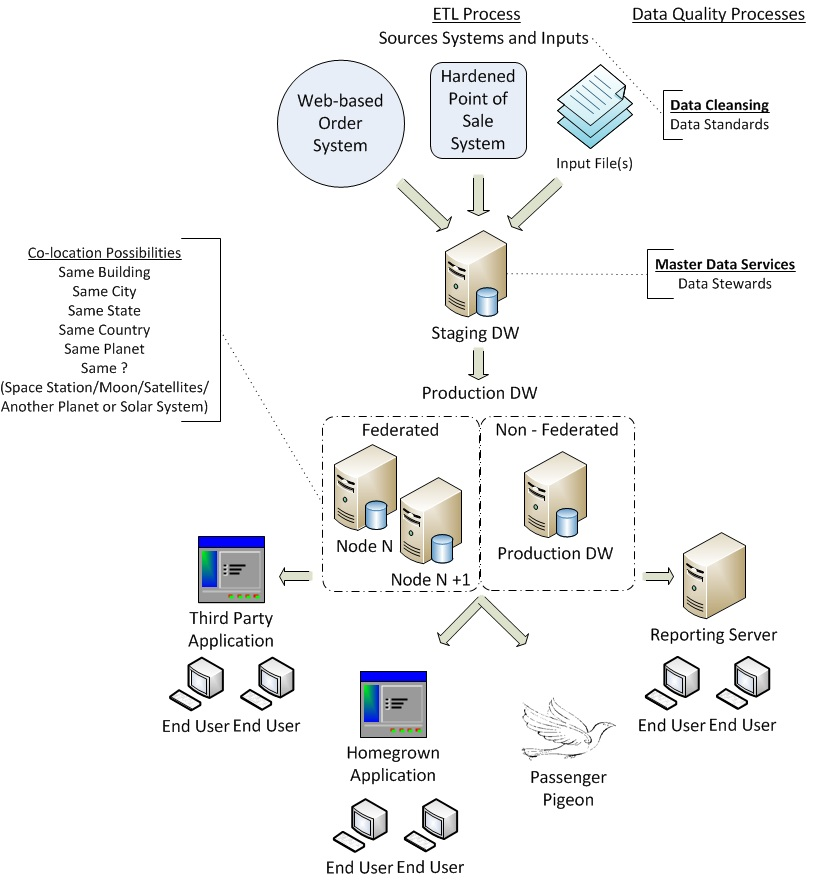

.. Data_Warehousing documentation master file, created by
   sphinx-quickstart on Tue Nov  5 09:41:39 2013.
   You can adapt this file completely to your liking, but it should at least
   contain the root `toctree` directive.

 

Distributed Computing and Data Warehousing.
************************************************************************

Distrbuted Principals
========================================================================

**CONTENT NEEDS TO BE ADDED**

What is a Data Warehouse
========================================================================

**Purpose:** The function of a data warehouse is to provide decision making support.

**Scope:** It should answer 1 to 3 questions.  Anymore and another warehouse or a datamart is needed.

**Process Success:** They are notoriously hard to build.  There should be 90% planning and 10% build.
Stake holder buyin is a key factor in any DW effort.  Smaller groups focussing on 
seperate business lines or functional groups tends to work better in the information 
gathering process.  From these draw a standard based on a majority usage, or if
not a majority in number then a driving weighted priority, and fold other groups 
and needs into the standard with the support of management.

Data Warehouse Elements
========================================================================

Leveraging a distributed model allows multiple needs to be addressed and keeps your analytical needs running from contending with your transactional usage.

Data Movement Process
++++++++++++++++++++++++++++++++++++++++++++++++++++++++++++++++++++++++

ETL

* Extract
	* Pull data from a source environment
* Transform
	* Manipulate the form of the data, but not the value, converting from the source structure to the desired target structure
* Load
	* Move the data into a destination system

  
  
Data Quality Processes
++++++++++++++++++++++++++++++++++++++++++++++++++++++++++++++++++++++++

Data Quality Services - Insuring the data quality in the source

* example
	* Source system - Record is changed
		* J Smith is updated to John Smith
		* john smith is updated to John Smith

Master Data Services - Maintaining uniform data version for presentation

* example

	* Source System - All entries remain unchanged
		* John Smith
		* J Smith
		* john smith
		* jon smith
		* John Smith
	* Data Warehouse System - A golden record chosen by the data stewards
		* John Smith is presented to all requests for information

		
Code Examples
++++++++++++++++++++++++++++++++++++++++++++++++++++++++++++++++++++++++

**CONTENT NEEDS TO BE ADDED**

**Possibilities**

**Query of a data warehouse**
**formating code**

Design Aspects
++++++++++++++++++++++++++++++++++++++++++++++++++++++++++++++++++++++++
The design choices you make in building your data warehouse environment with greatly
impact your method and scope of distribution.
  
	* Warehouse Architectures
		* Independent Data Marts
		* Data Mart Bus Architecture
		* Hub-and-Spoke
		* Centralized Data Warehouse
		* Federated Architecture

	* Data Design Approaches
		The two major schools of thought that have devolped over the past decade come from William Inmon and Ralph Kimball.
		
		* Inmon believes in a centralized single version of the data that can be parsed out to more specific needs and purposes.  This is referred to as the top-down approach.
		* Kimball believes in creating smaller tailored data marts that can be integrated and rolled-up to a larger picture.  This refered to as the bottom-up approach.

	* Data Schemas
		Inmon advocates a relational model which involves organizing data into tables, which are comprised of fields, with a 
		goal to minimize redundancy and dependency.  Normalization usually involves dividing large tables into 
		smaller (and less redundant) tables and defining relationships between them.  The objective is to isolate data 
		so that additions, deletions, and modifications of a field can be made in just one table and then propagated 
		through the rest of the database using the defined relationships.
 
		.. image:: RelationalSchema.jpg
		   :align: center 

		Kimball advocates a variation of the relational model that uses multidimensional structures 
		to organize data and express the relationships between data.  These structures are also known as cubes.
		Here are two examples of stuctures used in the mutidimensional model
		
		* Star
			* Tables are more denormalized, they duplicate data, which requires more disk storage

			.. image:: StarSchema.jpg
				:align: center
		* Snowflake
			* Joins are costly and require more CPU and Memory
			.. image:: SnowflakeSchema.jpg
				:align: center

	* Resource Distribution
		* Tables, indexes, or file groups can be located on different resources
		* Tables and indexes can be partitioned so individual parts can reside on different resources
   
Factors That Affect Choosing A Data Warehouse Architecture
========================================================================

* Stakeholder Buy-in
* Financial Resources
* Timeline

References
========================================================================

**CONTENT NEEDS TO BE ADDED**

.. toctree::
   :maxdepth: 2

Indices and tables
==================

* :ref:`genindex`
* :ref:`modindex`
* :ref:`search`

