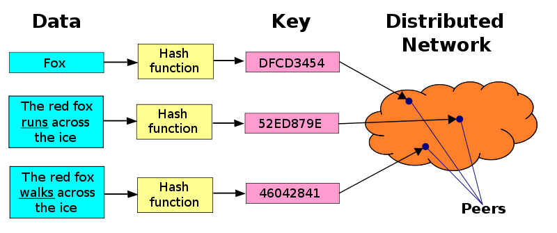

.. Distributed-Hash-Tables documentation master file, created by
   sphinx-quickstart on Sun Oct 27 15:39:59 2013.
   You can adapt this file completely to your liking, but it should at least
   contain the root `toctree` directive.

Distributed-Hash-Tables's Contents
********************************************************
What are Distributed Hash Tables?
===================================================
- Overall.

	- Lookup system that is similar to a standard hash table.
	- Distribute data over peer to peer networks to quickly find any item and form data storage responsibility
	- Nodes can retrieve the values.
	- Because responsibility is distributed among the nodes, things can change with minimal disruption.
	- Scales very well.

- Properties.

	- Autonomony and Decentralization.
	- Fault Tolerance.
	- Scalability (up to millions of nodes).

- Structure.

	- Foundation of an abstract keyspace (160-bit strings).
	- Keyspace partitioning: splits ownership of space among the nodes.
	- Overlay network: connects the nodes.

- Keyspace Partitioning.

	- Map keys to nodes.
	- Each node has an identifier key.
	- Most DHTs use consistent hashing: allows for adding and removing nodes with less impact
	- Locality-preserving hashing: similar keys assigned to similar objects

- Overlay Network.

	- Each node has links to other nodes which form the network.
	- Network Topology.
	- Key-based routing.
	- Worst case route: at least at big at the diameter.

- Algorithms for Overlay Networks.

	- Overlay multicast: delivers information to many nodes at the same time. 
	- Range queries: gather all information within a certain range.
	- Collect Statistics.

- Architecture.

   Picture provided by: http://en.wikipedia.org/wiki/File:DHT_en.svg.

- What are DHTs good at?

	- Very scalable because they can automatically distribute things to new nodes.
	- Designed to prevent node failure.  Data is automatically moved away from a failed node.
	- They have no need for a central server because they are self organizing.

- What are DHTs bad at? 

	- Searching: due to their hash algorithm, similar data can be at different nodes.  ****This is not the same as a DHT lookup.
	- Security: data integrity is hard to verify and secure routing is a problem.

Implementations
===================================================
- Apache Cassandra.

	- This is an open source distributed database management system.  It handles large amounts of data and provides high availability without a single point of failure.  The system places a high value on performance. 
	- Rows are organized into tables.  Tables can also be altered at runtime.  However, there is no support for joins or subqueries. 
	- Column indexes with log-structures updates, support for denormalization and materialized views. Powerful Built in caching.
	- The system is proven to work.  It is used in netflix, eBay, Twitter, Reddit, and more. The largest use has over 300TB of data in 400 machines.
	- The main features of Apache Cassandra are: Fault tolerance, performance, decentralized, durable, control, elasticity, and professional support. 

- Mainline DHT.

	- Mainline DHT is teh DHT used by BitTorrent clients to find peers.  It was designed for decentralized peer-to-peer networks.  The decentralization allows for more resistance to a denial of service attack (proper internet use). 
	- The DHT stores resource locations around the network allowing for quick and easy lookup.  This method makes it a perfect technology to use in peer-to-peer systems. 

- CAN (Content Addressable Network).

	- This infrastructure provides hash table functionality on a large scale.  It is a distributed and decentralized peer-to-peer structure.  
	- It is designed to be scalable, fault tolerant, and self-organizing.  It uses a Catersian coordinate system for virtual addresses.  Each node maintains a routing table holding the IP address and coordinate of each of its neighbors.  
	- This structure can perform node joining and departing. 

- BATON Overlay.

	- BATON: BAlances Tree Overlay Network is a distributed tree structure for peer-to-peer systems. It supports range search by organizing peers in a tree structure. The systems keeps the tree balanced similarly to AVL trees. 
	- Because of the tree structure BATON has a quick search of O(log N).
	- It is a binary tree structure with links to child and parents nodes.  BATON does support node joining and leaving. The tree automatically restructures itself when it detects an inbalance. 

- JDHT.
	
	- Java has it's only DHT implementation.  It is based on java.util.Map making it very easy to learn for those familiar with java Maps already.  
	- This code  shows a server setting up a local DHT and adding to it::

		import org.kth.dks.JDHT;  
		import java.io.*;
		public class JDHTServer {
			public static void main(String[] arg) {
				try {
					// Could declare myDHT as a java.util.Map
					// default port 4440 
					JDHT myDHT = new JDHT();
					// Insert data into the DHT
					myDHT.put("myKey", "Hello World!");
					// Print a reference to this node
					System.out.println( ((JDHT)myDHT).getReference() );
					// Wait for input before exiting
					BufferedReader cin = new BufferedReader( new InputStreamReader(System.in) );
					cin.read();
					// shut down
					myDHT.close(); 			
				} 
				catch(Exception ex) { ex.printStackTrace(); }
			}
		}

	- This code connects to a node in the DHT::

		import org.kth.dks.JDHT;
		public class JDHTClient {
		//@param args contains a reference to an existing node in a DHT 
			public static void main(String[] args) {
				if (args.length!=1) System.exit(0); 
				try {
					// Start an instance listening on port 5550
					// Connect to an existing node running a DHT at args[0]
					JDHT myDHT = new JDHT(5550, args[0]);
					String helloString = (String) myDHT.get("myKey");
					System.out.println(helloString);
					myDHT.close();
				}
				catch (Exception e) { e.printStackTrace(); }	
			}	
		}

Used to Build
===================================================
- Distributed File Systems such as Tahoe.

	- Tahoe is python bases and spreads data among several machines.  The file system has 3 layers.  The base layer is a DHT. 
	- The DHT has mutable and immutable slots. Immutable slots can only be writtent to once, while mutable slots can be written to and changed multiple times. 
	- One DHT maps the storage index to the encrypted file. Another DHT maps the to the plaintext. 

	- Picture provided by: https://code.google.com/p/nilestore/wiki/TahoeLAFSBasics.
	
- Instant Messaging.

	- DHTs can solve the rendezvous problem.  Instant messengers use usernames and IP addressed to work.  Essentially the username and IP address work as a key value pair.  As long as both instant message users can communicate with the same DHT, then the program can identify the users' IP addresses and allow them to talk to each other. 
	- Example from Brad Karp at University College London.  Someone would like to instant message with Fred.
	- H = hash(fred); DHT-put(H, 128.16.64.22).
	- H = hash(fred); IP = DHT-get(H).
	- The concept is very similar to that hash tables we are used to using.
	- Retro Messenger is a good open source example of an instant messaging application using a DHT.  
 
- Peer-to-Peer file sharing.

	- P2P routing can use a DHT based routing algorithm. 
	- IP addresses are stored as keys.

Notable Distributed Networks using DHT
===================================================
- BitTorrent Distributed Tracker.

	- The tracker responds to upload and download requests. The DHT is made up of node and in a P2P situation stored the location of peers. Each node knows good nodes and has a routing table of them.  This is what is used as a starting point in a DHT lookup.  
	- The DHT allows for the looking up and storing of IP addresses by BitTorrent infohash.  When someone requests a certain file, the DHT allows for the return of a set of IP addresses.  The DHT ensures efficent routing of put/get requests. 
	- Using a DHT instead of a central repository does result in more network overhead and processor power usage.  Overall the DHT has a major advantage in that it does not have a central point of failure.  

- Coral Content Distribution Network.
	
	- It is based on p2p technologies and allows users to run websites with higher performance.  CoralCDN is free.
	- When publishing through Coral a p2p layer helps to minimize the load on the web server.  It uses the bandwidth of a world wide network of proxies and servers.  
	- Coral uses a DHT which contains self-organizing nodes.  The nodes get information from each other to avoid having to communicate with far away servers. Coral uses a "sloppy" distributed hash table which is made up of rings of hash tables.  Coral will only query the larger (or farther away rings) if they are not overloaded.  The nodes will just query the closer nodes and then progress from there.  
	- Note: Coral is not a DHT, it just has one in its architecture. 

Resources
===================================================
- http://www.ietf.org/proceedings/65/slides/plenaryt-2.pdf.
- https://www.usenix.org/legacy/event/osdi00/full_papers/gribble/gribble_html/node4.html.
- http://cassandra.apache.org/.
- Ratnasamy et al. (2001). A Scalable Content-Addressable Network. In Proceedings of ACM SIGCOMM 2001. Retrieved 2013-05-20.
- Guido Urdaneta, Guillaume Pierre and Maarten van Steen. A Survey of DHT Security Techniques. ACM Computing Surveys 43(2), January 2011.
- Azureus.sourceforge.net.
- H. V. Jagadish, Beng Chin Ooi, and Quang Hieu Vu (2005). "BATON a balanced tree structure for peer-to-peer networks". Proceedings of the 31st international conference on very large data bases, Trondheim, Norway.
- http://www0.cs.ucl.ac.uk/staff/b.karp/d15/im-coursework.pdf.
- http://retromessenger.sourceforge.net/.
- http://arstechnica.com/tech-policy/2009/11/pirate-bay-kills-its-own-bittorrent-tracker/.
- https://tahoe-lafs.org/~warner/pycon-tahoe.html.
- Z. Wilcox-O'Hearn and B. Warner, "Tahoe: the least-authority filesystem," in Proceedings of the 4th ACM international workshop on Storage security and survivability, StorageSS '08, (New York, NY, USA), pp. 21{26, ACM, 2008.
- M. S. Miller, Robust Composition: Towards a Unied Approach to Access Control and Concurrency Control. PhD thesis, Johns Hopkins University, Baltimore, Maryland, USA, May 2006.
- "Tahoe lafs documentation." http://tahoe-lafs.org/trac/tahoe-lafs/wiki/Doc.
- http://www.coralcdn.org/.
- http://dks.sics.se/jdht/.
.. toctree::
   :mgenindex`
* :ref:`modindex`
* :ref:`search`

