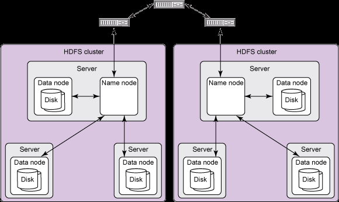
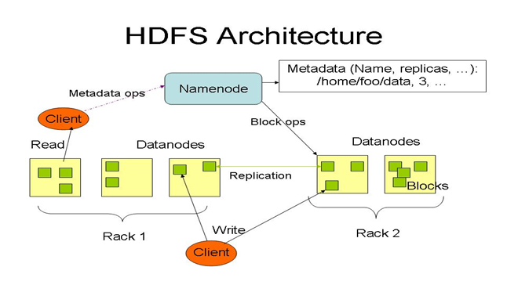
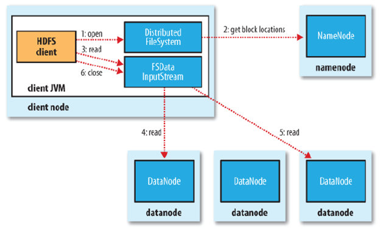
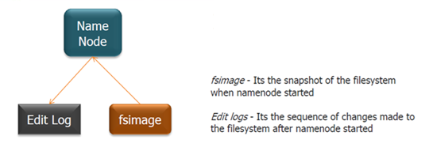

.. Hadoop Distributed FS documentation master file, created by
   sphinx-quickstart on Mon Oct 21 00:37:05 2013.
   You can adapt this file completely to your liking, but it should at least
   contain the root `toctree` directive.

Hadoop Distributed File System
================================

.. toctree::
   :maxdepth: 2

Hadoop is:	
	- An open source, Java-based software framework
	- Supports the processing of large data sets in a distributed computing environment
	- Designed to scale up from a single server to thousands of machines
	- Has a very high degree of fault tolerance
	- Possible to run application on systems with thousands of nodes involving thousands of terabytes
	- Consists of two main layers:
		- Hadoop Distributed File Systems(HDFS): Distributes data
		- Map/Reduce: Distributes application

1. HDFS
--------
- File system component of Hadoop
- Master/Slave architecture
- Separately stores file system metadata and application data
- Stores metadata on a dedicated server(Master), called the NameNode
- Stores application data on a number of other servers(Slave), called DataNodes
- Single NameNode and many DataNodes(100s or 1000s of nodes)

   
2. Architecture
----------------
- Comprised of interconnected clusters of nodes where files and directories reside
- A single NameNode, that manages the file system namespace
- DataNodes store data as blocks within files.

	   	   
	   *(High-level view)*	   

	   	   
	   *(HDFS Architecture)*	   

2.1 NameNode and DataNodes
^^^^^^^^^^^^^^^^^^^^^^^^^^^
- **NameNode:**	

	- Bookkeeper of HDFS. Repository for all HDFS metadata
	- Its function is memory and I/O intensive. So the server hosting the NameNode typically does not store any user data
	- Executes file system namespace operations; like; opening, closing, and renaming files and directories
	- Maintains the namespace tree and the mapping of file blocks to DataNodes
	- Files and directories are represented by *inodes*
	- Regulates client access to files
	   	   	   

- **Secondary NameNode:**	

	- An assistant daemon for monitoring the state of the cluster HDFS
	- Like the NameNode, each cluster has one Secondary NameNode
	- Differs from the NameNode:
		- It does not receive or record any real-time changes to HDFS
		- Instead, it communicates with the NameNode to take snapshots of HDFS metadata at intervals defined by the cluster configuration	

.. figure:: figures/architecture/secondary_namenode.png
	   :align: center
	   :scale: 50%	   
	   :alt: Secondary NameNode

- **DataNodes:**

	- Manage storage attached to the nodes that they run on
	- A file is splitted into one or more blocks *(typically 128MB)*. These blocks are stored in a set of DataNodes
	- Performs block creation, deletion, and replication upon instruction from the NameNode
	- Data blocks are replicated for fault tolerance and fast access
	- DataNodes send *heartbeats* to the NameNode to confirm that the DataNode is working and the block replicas it hosts are available
	- Responsible for serving read and write requests from the file system's client

2.2 File System Namespace
^^^^^^^^^^^^^^^^^^^^^^^^^^
- Traditional hierarchical file organization
- User/Application can:
	- Create directories
	- Create/delete/remove/rename a file
	- Maintains the file system
	- Any meta information changes to the file system recorded by the NameNode

2.3 File Read and Write 
^^^^^^^^^^^^^^^^^^^^^^^^
- Single-writer, multiple-reader model
- An HDFS file consists of blocks
- When there is a need for a new block, the NameNode allocates a block with a unique block ID
- It also determines a list of DataNodes to host replicas of the block
- The DataNodes forms a pipeline, the order of which minimizes the total network distance from the client to the last DataNode

3. HDFS Client
----------------
- User applications access the file system using this client
- Supports operations to read, write and delete files, and operations to create and delete directories

3.1 Read Operation
^^^^^^^^^^^^^^^^^^^^
When an application reads a file, the HDFS client first asks the NameNode for the list of DataNodes that host replicas of the blocks of the file. It then contacts a DataNode directly and requests the transfer of the desired block

3.2 Write Operation
^^^^^^^^^^^^^^^^^^^^^
When a client writes, it first asks the NameNode to choose DataNodes to host replicas of the first block of the file. The client organizes a pipeline from node-to-node and sends the data. When the first block is filled, the client requests new DataNodes to be chosen to host replicas of the next block. A new pipeline is organized, and client sends the further bytes of the file

.. figure:: figures/architecture/client_interaction.png
	:align: center
	:alt: Client Interaction	
	:scale: 50%	
	   	   
	*(An HDFS client creates a new file by giving its path to the NameNode. For each block of the file, the NameNode returns a list of DataNodes to host its replicas. The client then pipelines data to the chosen DataNodes, which eventually confirm the creation of the block replicas to the NameNode)*	   

HDFS provides an API that exposes the locations of a file blocks. This allows applications like the MapReduce framework to schedule a task to where the data are located

4. Data Replication
---------------------
- Blocks of a file are replicated for fault tolerance
- An application can specify the number of replicas of a file
- The NameNode makes all decisions regarding replication of blocks
- NameNode periodically receives a Heartbeat and a Block-report from each of the DataNodes in the cluster
- Heartbeat implies that the DataNode is functioning properly. A Block-report contains a list of all blocks on a DataNode

4.1 Replica Placement
^^^^^^^^^^^^^^^^^^^^^^^
- The placement of replicas are critical to HDFS reliability and performance
- Rack-aware replica placement model is used to improve reliability, availability and network bandwidth utilization
- Communication between two nodes in different racks has to go through switches
- Network bandwidth between machines in the same rack is greater than network bandwidth between machines in different racks
- NameNode determines the rack id for each DataNode
- Replicas are typically placed on unique racks. This prevents losing data when an entire rack fails and allows use of bandwidth from multiple racks when reading
	- easy to balance load on component failure, but not an optimal process
	- increase the cost of writes because a write needs to transfer blocks to multiple racks

- To minimize cost, HDFS put *(replication factor is 3)* one replica on one node in the local rack, another on a different node in the local rack, and the last on a different node in a different rack
- Thus 1/3 of replicas are on one node, 2/3 of replicas are on one rack, and the last 1/3 are evenly distributed across the remaining racks

4.2 Replica Selection
^^^^^^^^^^^^^^^^^^^^^^^
- To minimize global bandwidth consumption and read latency, HDFS tries to read a block from a replica that is closest to the reader
- If there is a replica on the reader node, then that replica is referred
- Else if there is a replica on the same rack as the reader node, then that one is preferred
- For a HDFS cluster, that may span multiple data centers, replica in the local data center is preferred over the remote one

5. File System Metadata
-------------------------

- HDFS namespace is stored by NameNode
- NameNode uses a transaction log called the EditLog to record every change that occurs to the file system meta data
	- creating a new file
	- change replication factor of a file
- Editlog is stored in the NameNode's local filesystem
- Entire filesystem namespace including mapping of blocks to files and file system properties is stored in a file FsImage, stored in NameNode's local filesystem

6. Robustness
-------------
- Primary objective of HDFS is to store data reliably even in the presence of failure
- Three common types of failures:
	- NameNode failures
	- DataNode failures
	- Network partitions

6.1 DataNode failure and Heartbeat
^^^^^^^^^^^^^^^^^^^^^^^^^^^^^^^^^^^
- A network partition can cause a subset of DataNodes to lose connectivity with the NameNode
- NameNode detects this condition by the absence of a Heartbeat message

- NameNode marks DataNodes without Heartbeat and does not send any IO requests to them
- Any data registered to the failed DataNode is not available to the HDFS
- Also the death of DataNode may cause replication factor of some data blocks to fall below their specified value

6.2 Re-replication
^^^^^^^^^^^^^^^^^^^^^
- NameNode constantly tracks which blocks need to be replicated and initiates replication whenever necessary
- Necessity of replication may arise due to:
	- A DataNode may become unavailable
	- A replica may become corrupted
	- A hard disk on a DataNode may fail
	- The replication factor of a file may be increased

6.3 Cluster Re-balancing
^^^^^^^^^^^^^^^^^^^^^^^^^^
- HDFS architecture is compatible with data re-balancing schemes
- A scheme might move data from one DataNode to another if the free space on a DataNode falls below a certain threshold
- In the event of a sudden high demand for a particular file, a scheme might dynamically create additional replicas and re-balance other data in the cluster
- These types of data re-balancing are not yet implemented

6.4 Data Integrity
^^^^^^^^^^^^^^^^^^^
- Consider a situation, a block of data fetched from DataNode arrives corrupted
- This corruption may occur because of faults in a storage device, network faults, or buggy software
- A HDFS client creates the checksum of every block of its file and stores it in hidden files in the HDFS namespace
- When a clients retrieves the contents of file, it verifies that the corresponding checksums match
- If does not match, the client can retrieve the block from a replica

6.5 Metadata Disk Failure
^^^^^^^^^^^^^^^^^^^^^^^^^^^
- FsImage and EditLog are central data structures of HDFS
- A corruption of these files can cause a HDFS instance to be non-functional
- For this reason, a NameNode can be configured to maintain multiple copies of the FsImage and EditLog
- Multiple copies of the FsImage and EditLog files are updated synchronously
- Meta-data is not data-intensive
- The NameNode machine is a single point of failure for a Hadoop cluster
- If the NameNode fails, manual intervention is necessary
- The Secondary NameNode help minimize the downtime and loss of data
- Automatic restart and fail over of NameNode is NOT supported yet! Still a research topic!

7. Accessibility
-----------------
HDFS can be accessed from applications in many different ways. Natively HDFS provides a Java API for applications to use. In addition a HTTP browser can also be used to browse the files of an HDFS instance.

7.1 FS Shell
^^^^^^^^^^^^^
- HDFS allows user data to be organized in the form of files and directories
- Provides a command line interface called FS shell that lets a user interact with the data in HDFS
- Syntax is similar to other shells(e.g. bash, csh)
- Some commands:
	- Create a directory named "/testdir": bin/hadoop dfs -mkdir /usr/testdir
	- Create a file named "myfile.txt": bin/hadoop dfs -touchz /usr/testdir/myfile.txt
	- View the contents of the file: bin/hadoop dfs -cat /usr/testdir/myfile.txt

7.2 DFSAdmin
^^^^^^^^^^^^^^
- The DFSAdmin command set is used for administering an HDFS cluster
- Used only by an HDFS administrator
- Sample commands:
	- Generate a list of DataNodes: bin/hadoop dfsadmin -report
	- Decommission DataNode: bin/hadoop dfsadmin -decommission *datanodename*

7.3 Browser Interface
^^^^^^^^^^^^^^^^^^^^^^^
- Default HDFS install configures a web server to expose the HDFS namespace through a configurable TCP port 
- Allows the user to navigate the HDFS namespace and view the contents of its files using a web browser

Indices and tables
==================

* :ref:`genindex`
* :ref:`modindex`
* :ref:`search`

