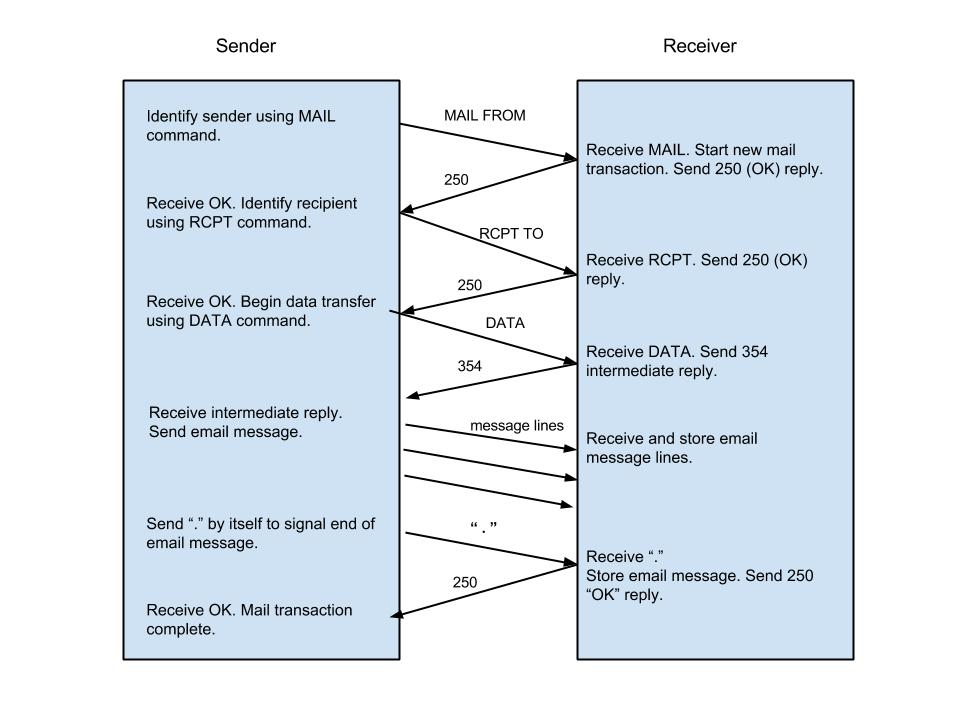

SMTP Mail Transaction Process
==============================

* Transaction Initiation and Sender Identification
	* Sender tells receiver it wants to start sending message
	* Sender gives the email address of the message sender
* Recipient Identification
	* Sender gives the email address(es) of the recipients of this email
* Mail Transfer
	* Sender transfers email message according to the RFC 2822 specification, for message format. 
* Why isn’t it just a single step? 
	* Separation of the sender and recipient information from the message.
	* Gives SMTP receiver the information up front.
	* Greater control on distribution.
	* Allows for easier security implementation

	


* 3 command/reply sequences
	* Sender identified using MAIL command
	* Each Recipient identified with one RCPT command
	* Message transferred with the DATA command

